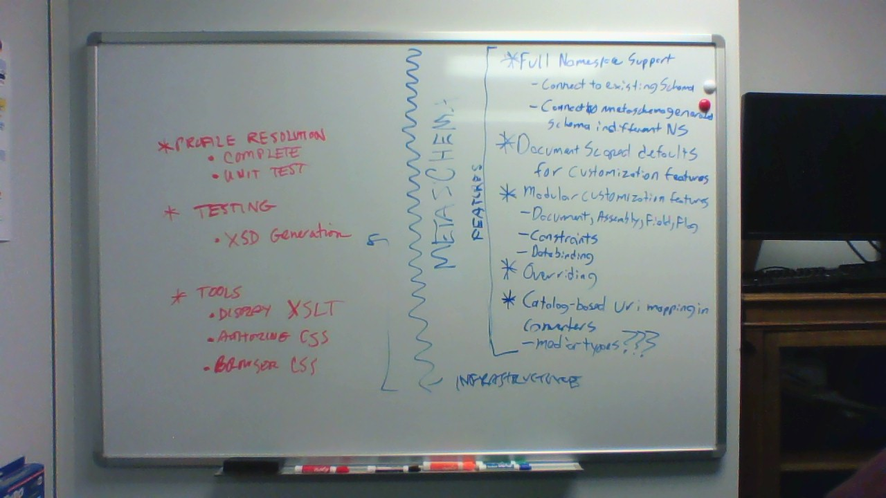

# Metaschema plans

## Feature set

Dave's outline is to the right on this picture.

This is not an exclusive list!

Transcript:

* Full Namespace Support
  - connect to existing schema
  - connect to metaschema-generated schema in different NS
* Document-scoped defaults
  - for customization features
* Modular customization features
  - Document, Assembly, Field, Flag
  - Constraints
  - Data binding
* Overriding
* Catalog-based URI mapping in converters

The red to left is all about OSCAL, not Metaschema.
