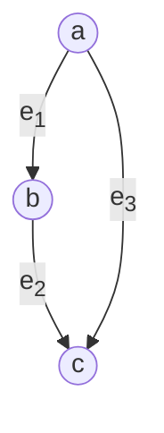
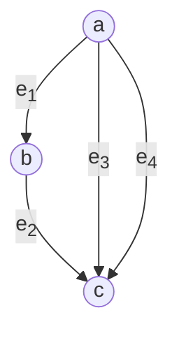
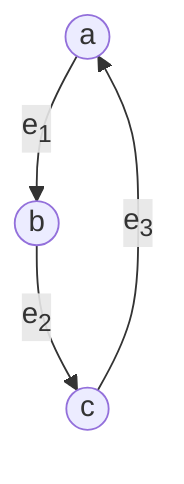
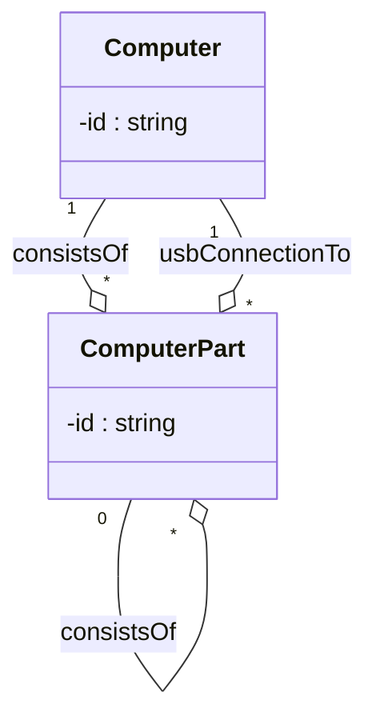
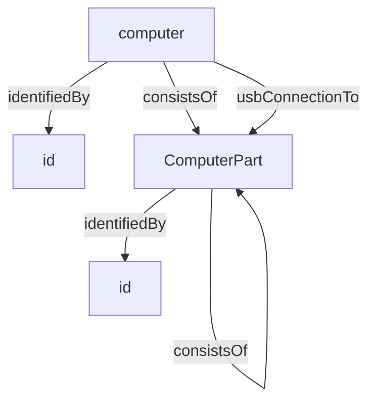

# Overview `test`

The *Metaschema Modeling Framework* provides a means to represent an [*information model*](/specification/terminology/#information-model) for a given [*information domain*](/specification/terminology/#domain), consisting of many related [*information elements*](/specification/terminology/#information-element), in a *data format* neutral form. By abstracting information modeling away from *data format* specific forms, the Metaschema Modeling Framework provides a means to consistently and sustainably maintain an *information model*, while avoiding the need to maintain each derivative *data format* individually. By consolidating *information model* maintenance into a single representation, significant time can be saved over other approaches that require each *data format* to be maintained individually.

A Metaschema-based *information model* is represented in an abstract XML-based format, called a [*Metaschema module*](/specification/terminology/#metaschema-module). A *Metaschema module* represents implementations of the individual *information elements* of the *information model* using [*definitions*](/specification/terminology/#definition). These *definitions* are bound tightly to representational forms in each supported derivative *data format*, unifying representations for a given information model. Based on the tight binding provided by the Metaschema Modeling Framework, a given *information model* can be used to deterministically generate a [*data model*](/specification/terminology/#data-model) in a *data format* specific form.

The Metaschema framework currently supports XML, JSON, and YAML *data formats*. Support for YAML is limited to the subset of YAML that aligns with JSON representations.

This tight binding to supported derivative data formats has many advantages.

1. **Automated Schema Generation:** Schema representations for a given supported *data format* can be automatically generated from a Metaschema module. A generated schema can be used to validate that data is conformant to the associated *data model*, ensuring that this data is conformant to the *information model* defined by the *Metaschema module*. When the *information model* is changed, an updated schema representation can be automatically generated.
1. **Automated Translation of Content:** Data represented using a *data model* derived from a *Metaschema module* can be automatically translated into an alternate *data model* based on the same *Metaschema module*. This allows data aligned with a derived *data model* to be automatically converted into data representations in all other *data models* derived from the same *Metaschema module*.
1. **Automated Documentation Generation:** *Data model* specific documentation can be automatically generated from a *Metaschema module*. This generated documentation is oriented to the syntax and concepts of the *data format* used by the *data model*, providing a format-specific view of an *information model*.
1. **Automated Parsing Code Generation:** Programming language specific parsing and content generation code can also be automatically generated using a *Metaschema module*, supporting data deserialization and serialization for all derived *data models*. The data structures generated represent the *information model* allowing data read from and written to all derived *data models* to be represented in a singular set of data structures. This generative approach allows application developers to focus right away on business logic and user interface features, instead of building the data structures needed to represent the *data models* for a given *information domain*.

The following illustrates the Metaschema Framework architecture as described above.


These capabilities can be applied to any *information domain*, serving developers who need to support multiple *data models* for a given *information domain* or a format specific technology stack that is well-suited to their application based on a single *data model* equally. In either case, use of the generative capabilities supported by the Metaschema Framework, further reduces the time required to maintain format-specific documentation, schemas, data, and parsing code in one or multiple *data formats*.

This specification provides a basis for the development of interoperable toolchains supporting the generative capabilities of the Metaschema Framework. This specification is also intended to serve as a reference for information modelers producing Metaschema-based *information models*.

## Design Goals

The design of the Metaschema modeling approach addresses the following needs:

1. **Ease Maintenance:** Reduce the implementation burden of supporting multiple *data formats* for a single *information model*, along with documentation, schemas, data, and related tooling.
1. **Ease Format Adoption Costs:** Reduce the cost of adopting a new supported *data format* for use with a given *information model*. As bindings to new *data formats* are supported by the Metaschema Modeling Framework, users of supporting tools gain use of the new *data format*.
1. **Unified Format Support:** Unify support for compatible data descriptions in multiple *data formats*, such as XML, JSON, YAML and potentially others over time. For a given *information model* data can be easily translated between *data models* in all supported *data formats*.
1. **Ease Production of Data Format Documentation:** Produce *data model* documentation from the same source as schema files and associated tools.
1. **Promote Information Model Experimentation:** Enable distributed, semi-coordinated experimentation around information concepts within a given *information domain*. *Information elements* can be easily added, modified, and removed. Documentation, schemas, and tools can be quickly updated using automated generative tools supported by a given *Metaschema module*.

## Design Approach

The Metaschema Modeling Framework provides a reduced, lightweight modeling language with constraints that apply at the level of the information model abstraction.

The following philosophy was used in the current design:

- **Mediate Format Structural Differences:** Mediate between the structural differences in the XML, JSON, and YAML *data formats* by providing format-specific tailoring capabilities that improve the expression and conciseness of Metaschema-based data in a given format. This has the added benefit of making Metaschema easier to learn and use over learning the idiosyncrasies of each *data format*.
- **Capitalize on Format Features:** To the extent possible, maximize the use of *data format*-specific features, while still aligning modeling functionality across all supported *data formats*. In some cases, support for specific *data format* and schema features may be omitted where these features do not align well across all supported *data formats*.
- **Unify Information Modeling Across Formats:** Use modeling constructs that map cleanly into features offered by XML and JSON schema technologies. This ensures that all information can be preserved, without data loss in bidirectional conversion.
- **Reduce Runtime Complexities:** Eliminate the need for additional inputs, reliance on arbitrary conventions, or runtime settings to reliably produce correspondent XML, JSON or YAML from any other supported *data format*.
- **Focus on Running Code:** Focus on the production of a rich specification that facilitates running code supporting automated generation of schemas, documentation, tooling, and other model-related artifacts consistent with the *information model* defined and documented by a given *Metaschema module*.

# Conventions Used in this Document

The key words "MUST", "MUST NOT", "REQUIRED", "SHALL", "SHALL NOT", "SHOULD", "SHOULD NOT", "RECOMMENDED", "NOT RECOMMENDED", "MAY", and "OPTIONAL" in this document are to be interpreted as described in [BCP 14](https://www.rfc-editor.org/info/bcp14) [RFC2119](https://www.rfc-editor.org/rfc/rfc2119.html) [RFC8174](https://www.rfc-editor.org/rfc/rfc8174.html) when, and only when, they appear in all capitals, as shown here.

# Information Modeling

The following diagram illustrates the relationships between information modeling concepts and the core structures provided by the Metaschema Framework.


An [*information model*](terminology/#information-model) is an abstract representation of information from a given information [*domain*](terminology/#domain). An *information model* is composed of a set of semantically well-defined information structures that each represent an [*information element*](terminology/#information-element) in the information domain.

The primary purpose of the Metaschema Framework is to support the structured expression of an information model, which is represented as a [*Metaschema module*](terminology/#metaschema-module). A Metaschema module is used to represent the whole or a part of a information model for a given information domain in an information-centric, format-neutral form.

## Graph Theoretical Basis of Metaschema

In a *Metaschema module*, an *information model* is represented as a cyclic directed multigraph.

*Information elements* are represented as the *nodes* of the graph, which are connected by *edges* that represent the relationships between *nodes*.



A *Metaschema module* is a *directed graph*, since the *edges* represent a set of ordered node pairs. This allows a *Metaschema module* to represent sequences of relationships. In the example above, `a` has two ordered relationships: <code>a</code> <code>-e<sub>1</sub>-></code> <code>b</code> and <code>a</code> <code>-e<sub>3</sub>-></code> <code>c</code>.

A *Metaschema module* is a *multigraph*, since two *nodes* may have multiple edges representing distinct relationships between the two nodes. This allows a *Metaschema module* to represent different relationships between the same two information elements, such as the relationships <code>e<sub>3</sub></code> and <code>e<sub>4</sub></code> between `a` and `c` below.



A *Metaschema module* is a *cyclic graph*, since a sequence of *nodes* and *edges* can form a circuit where the first and last *nodes* are the same. This allows a *Metaschema module* to represent recursive information structures. This is illustrated below where <code>a</code> <code>-e<sub>1</sub>-></code> <code>b</code> <code>-e<sub>2</sub>-></code> <code>c</code> <code>-e<sub>3</sub>-></code> <code>a</code> form a cycle with node `a` is the first and last node in the cycle.



In a *Metaschema module* a node is represented as a [*definition*](terminology/#definition). Each *definition* represents a given *information element* in an *information model*. Each *definition* contains data and documentation about the meaning (semantics), structure (syntax), and use of a given *information element*.

In a *Metaschema module* an *edge* is represented as an [*instance*](#instances), which establishes a relationship between two *information elements* in an *information model*. Each *instance* contains data and documentation about the relationship, including data about the cardinality, meaning (semantics), structure (syntax), and use of the relationship.

While a *Metaschema module* represents a cyclic directed multigraph, there are a few assumptions that ensure that data representations based on the information model conform to an oriented acyclic directed multigraph. This is necessary to support JSON and XML data representations which use a tree form.

- At least one root node MUST be defined in the *information model*. A root node ensures that orientation is supported, providing a root of the data tree. Multiple root nodes are also possible allowing multiple resulting oriented acyclic directed multigraphs to be produced.
- Nodes involved in a cycle MUST allow for cycle termination. This can be achieved by a zero minimum cardinality on an edge creating a cycle.

## Object-Oriented Basis of Metaschema

In a *Metaschema module*, the cyclic directed multigraph representing an *information model* is represented as a hierarchy using a *compositional* approach to describe *information elements*. This approach aligns well with the hierarchical form of JSON, YAML, and XML; and also supports programming language data structures that are based on object-oriented principles.

In object-oriented programming languages, a *class* can be used to represent an *information element*. An *object* represents a data instance of a *class*, which can also be considered an instantiation of an *information element*. Each composite *member* of a *class* can be used to represent a relationship to an *object* of another class. Thus, a *class member* represents a specific type of relationship between two *information elements*. This compositional form is often referred to as a `has-a` relationship.

For example:



In this example the `Computer` class establishes an aggregate compositional relationship `consistsOf` to a `ComputerPart` class. This is a way of stating that a computer is made up of a set of parts.

In a *Metaschema module*, the *information element* concepts of a `Computer` and a `ComputerPart` can be represented as a *definition*. Thus, a *definition* represents a *class*. The `consistsOf` relationship is represented as an *instance*. Thus, an *instance* represents a *class member*.

The following illustrates how the object-oriented approach used to describe a computer can be represented as a cyclic directed multigraph.



The duality of the *Metaschema module* as both a representation of a cyclic directed multigraph and a set of object-oriented classes is explored in this specification.

# Definitions, Instances, and Local Definitions

Metaschema uses 3 types of [*definitions*](#definitions) to represent information elements with different structural shapes: [`define-flag`](#top-level-define-flag), [`define-field`](#top-level-define-field), and [`define-assembly`](#top-level-define-assembly). These *definition* types are used as building blocks of a Metaschema-based model.

*Field definitions* and *assembly definitions* allow the identification of edges through the declaration of an [*instance*](#instances). An *instance* represents an edge between the containing definition and another definition. Thus, an *instance* makes use of another definition, typically by reference.

Both field and assembly definitions optionally allow the inclusion of one or more child [*flag instances*](#flag-instances).

An assembly definition also has a [complex model](#model) which contains a sequence of [*model instances*](#model-instances), each *model instance* is either a [*field instance*](#field-instances) or an [*assembly instance*](#assembly-instances).


Within a *Metaschema module*, the *information model* implementation consists of assemblies, each of which are composed of more assembly, field, and flag instances. 

*Field instances* and *assembly instances* support the composition of complex *information elements*.

Flag instances may exist on fields and assemblies, providing identifying or qualifying data about their containing definition.

The following example illustrates the use of each type of *definition*, and the use of *flag instances* and *model instances* to create a more complex model through composition.


The example above declares 4 distinct object definitions, along with their instances.

- The *flag definition* `flg-def-1` represents a reusable [*flag*](/specification/terminology/#flag).
- The *field definition* `fld-def-1` represents a reusable [*field*](/specification/terminology/#field).
- The *assembly definitions* `asmb-def-1` and `asmb-def-2` represent reusable [*assemblies*](/specification/terminology/#assembly).

Through the compositional use of *flag instances* and *model instances*, it is possible to build a complex *information element* by declaring how smaller *information elements* are combined together through composition.


In the example above, the *assembly definition* `asmb-def-1` and the *field definition* `fld-def-1` both instantiate the flag defined as `flg-def-1`. These *instances*, `flg-inst-1` and `flg-inst-2` respectively, are examples of *flag instances*. The *assembly definition* `asmb-def-1` declares the *flag instance* `flg-inst-1` as a composite child by referencing the *flag definition* `flg-def-1`. Similarly, the *field definition* `fld-def-1` declares the *flag instance* `flg-inst-2` as a composite child by referencing the *flag definition* `flg-def-1`.

Furthermore, the *assembly definition* `asmb-def-1` has a complex model that instantiates the *assembly definition* `asmb-def-2`, as `asmb-inst-1`, and the *field definition* `fld-def-1`, as `fld-inst-1`. These are examples of *model instances*.


*Assemblies* and *fields* also allow *inline definitions* to be declared which represent a single use *definition* that is also an *instance*. In these cases the inline `<define-flag>`, `<define-field>`, and `<define-assembly>` elements are used, which combine the data elements used to declare a *definition* and *instance* of the same type.

# Metaschema Module

A *Metaschema module* is represented using the top-level XML element `<METASCHEMA>`.

For example:

```xml
<?xml version="1.0" encoding="UTF-8"?>
<METASCHEMA xmlns="http://csrc.nist.gov/ns/oscal/metaschema/1.0">
  <schema-name>Computer Model</schema-name>
  <schema-version>0.0.5</schema-version>
  <short-name>computer</short-name>
  <namespace>http://example.com/ns/computer</namespace>
  <json-base-uri>http://example.com/ns/computer</json-base-uri>
  <remarks>
    <p>This is an example model to describe the components of a computer.</p>
    <p>The "computer" element is the root element of this model.</p>
  </remarks>
  <!-- followed by a series of imports, then a series of definitions -->
</METASCHEMA>
```

Attributes:

| Attribute | Data Type | Use      | Default Value | Section |
|:---       |:---       |:---      |:---           |:---      |
| [`@abstract`](#abstract-modules) | `yes` or `no` | optional | `no` | Header: [Abstract Module](#abstract-modules) |

Elements:

| Element | Data Type | Use      | Section |
|:---       |:---       |:---      |:---      |
| [`<schema-name>`](#schema-name) | [`markup-line`](/specification/datatypes/#markup-line) | 1 | Header: [Documentation](#module-documentation) |
| [`<schema-version>`](#schema-version) | version ([`string`](/specification/datatypes/#string)) | 1 | Header: [Documentation](#module-documentation) |
| [`<short-name>`](#short-name) | [`token`](/specification/datatypes/#token) | 1 | Header: [Documentation](#module-documentation) |
| [`<namespace>`](#xml-namespace) | [`uri`](/specification/datatypes/#uri) | 1 | Header: [XML Namespace](#xml-namespace) |
| [`<json-base-uri>`](#json-base-uri) | [`uri`](/specification/datatypes/#uri) | 1 | Header: [JSON Base URI](#json-base-uri) |
| [`<remarks>`](#remarks) | special | 0 or 1 | Header: [Documentation](#module-documentation) |
| [`<import>`](#module-imports) | special | 0 to ∞ | [Module Imports](#module-imports) |
| [`<define-assembly>`](#top-level-define-assembly),<br/>[`<define-field>`](#top-level-define-field), and<br/>[`<define-flag>`](#top-level-flag) | special | 0 to ∞ | [Module Definitions](#definitions) |

The first set of elements in a *Metaschema module* represent the *header*, which contains information about the *Metaschema module* as a whole. The remainder of this section discusses the use of these elements.


**Note:** There is no explicit separation between the *header* and the *definitions* in a *Metaschema module*. The header ends where the [`<import>`](#module-imports), [`<define-assembly>`](#top-level-define-assembly), [`<define-field>`](#top-level-define-field), and [`<define-flag>`](#top-level-define-flag) elements first appear.


## Module Documentation

Top-level documentation for the *Metaschema module* appears in the the *header* section.


The documentation within the *header* applies to the whole *Metaschema module*. Each child object *definition* will also have associated documentation that appears within that object's declaration.


The *header* may include the following elements, in order:

## Abstract Modules

The optional `@abstract` attribute indicates if the *Metaschema module* is intended to be used on its own or only for import into another *Metaschema module*.

The following values describe the intent of `@abstract` attribute.

- `no` - Indicates that the *Metaschema module* is usable on its own. This is the default behavior when `@abstract` is not declared.
- `yes` - Indicates that the *Metaschema module* is not usable on its own. Instead, the *Metaschema module* SHOULD only be *imported* by other Metaschema modules.


It's a best practice to mark *Metaschema modules* that are intended only for reuse in other *Metaschema modules* as `@abstract=yes`. This communicates to users of the module that the module is not standalone.


For example:

```xml {linenos=table,hl_lines=[3]}
<?xml version="1.0" encoding="UTF-8"?>
<METASCHEMA xmlns="http://csrc.nist.gov/ns/oscal/metaschema/1.0"
  abstract="yes">
  <!-- ... other content ... -->
</METASCHEMA>
```

### `<schema-name>`

The required `<schema-name>` is a line of [structured markup](/specification/datatypes/#markup-line) that provides a human-readable name, suitable for display, for the *information model* represented by this *Metaschema module*.

For example:

```xml
<schema-name>Computer Model</schema-name>
```

### `<schema-version>`

A required, unique string literal value indicating the distinct version assigned to the *Metaschema module*.

This version MUST provide a means to distinctly identify a given revision of the *Metaschema module* in a series of revisions. The value child of the `<schema-version>` SHOULD be a [semantic version](https://semver.org/), which allows for automatically determining if a given version precedes, matches, or succeeds another version.


Use of [semantic versioning](https://semver.org/), also referred to as "semver", in a `<schema-version>` is encouraged, since semver provides a standardized set of rules for how version numbers are assigned and incremented. This allows computation over version ranges and comparison of individual versions.


For example:

```xml
<schema-version>0.0.5</schema-version>
```

This example defines a semantic version with a major version of `0`, a minor version of `0`, and a patch version of `5`.

### `<short-name>`

A required, unique string literal value that identifies a series of revisions of the *Metaschema module*. Each revision in the series will have the same `<short-name>`.

For example:

```xml
<short-name>computer</short-name>
```

Together, the `<short-name>` and `<schema-version>` provide an identification pair that uniquely identifies a given *Metaschema module* revision. This pair of values is intended to be associated with any schemas, code, tools, or other derivative artifacts produced from the *Metaschema module*, providing for clear identification of the revision from which an artifact is derived.

### `<remarks>`

An optional sequence of [multiline markup](/specification/datatypes/#markup-multiline) used to provide additional supporting notes related to the *Metaschema module*.

A `<remarks>` element is typically used to include explanatory commentary of any kind.

For example:

```xml
<remarks>
  <p>This is an example model to describe the components of a computer.</p>
  <p>The "computer" element is the root element of this model.</p>
</remarks>
```


As a general purpose element, the `<remarks>` element is also permitted to appear elsewhere in the *Metaschema module* model. Its scope of application is tied to the location of use in the document. Thus, the top-level remarks relate to the entire *Metaschema module*, while remarks on a *definition* relate to the *definition*.


## XML `<namespace>`

The required `<namespace>` element is a [uniform resource identifier](https://www.rfc-editor.org/rfc/rfc3986) (URI) that identifies the [XML Namespace](https://www.w3.org/TR/xml-names/#sec-namespaces) to use for XML instances of the model.

All *information elements* defined in the *Metaschema module* will be assigned to this namespace when handling related XML data.


Note: *Information elements* defined in an [imported *Metaschema module*](#metaschema-definition-imports), will be assigned the namespace declared in that module's header. This makes it possible to use and differentiate *information elements* defined with different namespaces.


The XML namespace defined using this element will be the target namespace used in an XML schema generated from this *Metaschema module*.

## `<json-base-uri>`

The required `<json-base-uri>` element is a [uniform resource identifier](https://www.rfc-editor.org/rfc/rfc3986) (URI) that identifies the URI used in the [`$schema` keyword](https://datatracker.ietf.org/doc/html/draft-handrews-json-schema-01#section-7) in JSON Schemas generated from this *Metaschema module*.

# Definitions

A *definition* in a *Metaschema module* declares a reusable [*information element*](/specification/terminology/#information-element) within an [*information model*](/specification/terminology/#information-model).

In graph theoretical terms, a *definition* provides a declaration of an graph *node* and any associated *edges* that form a given subgraph shape.

In object-oriented terms, a *definition* provides a declaration of a *class*, along with any associated *class members*.

The following subsections describe the [common syntax](#common-definition-metadata) for all *definition* types, followed by the semantic and syntax details of each type of *definition*. The 3 types of *definitions* are [`<define-flag>`](#top-level-define-flag), [`<define-field>`](#top-level-define-field), and [`<define-assembly>`](#top-level-define-assembly).

## Common Definition Metadata

All *definition* types share a common syntax comprised of the following XML attributes and elements.

Attributes:

| Attribute | Data Type | Use      | Default Value |
|:---       |:---       |:---      |:---           |
| [`@deprecated`](#deprecated-version) | version ([`string`](/specification/datatypes/#string)) | optional | *(no default)* |
| [`@name`](#name) | [`token`](/specification/datatypes/#token) | required | *(no default)* |
| [`@scope`](#scope) | `local` or `global` | optional | `global` |

Elements:

| Element | Data Type | Use      |
|:---       |:---       |:---      |
| [`<formal-name>`](#formal-name) | [`string`](/specification/datatypes/#string) | 0 or 1 |
| [`<description>`](#description) | [`markup-line`](/specification/datatypes/#markup-line) | 0 or 1 |
| [`<prop>`](#prop) | special | 0 to ∞ |
| [`<use-name>`](#naming-and-use-name) | [`token`](/specification/datatypes/#token) | 0 or 1 |
| [`<remarks>`](#remarks) | special | 0 or 1 |
| [`<example>`](#example) | special | 0 to ∞ |

These attributes and elements are described in the following subsections.

### `@deprecated` Version

The optional `@deprecated` attribute communicates that use of the given *information element* implemented by the *definition* is intended to be discontinued, starting with the *information model* revision indicated by the attribute's value.

This *information model* revision is a reference to the [`<schema-version>`](#schema-version) declared in the *Metaschema module* *header*.


Declaring the `@deprecated` attribute communicates to content creators that all use of the annotated *information element* is to be avoided. 

This annotation can be used in documentation generation and in Metaschema-aware tools that provide context around use of the definition.


The following example illustrates deprecating the flag named `flag-name` starting with the *information model* semantic version `1.1.0`.

```xml {linenos=table,hl_lines=[3]}
<define-flag
  name="flag-name"
  deprecated="1.1.0"/>
```

### `@name`

The `@name` attribute provides the definition's identifier, which can be used in other parts of a module, or in an importing *Metaschema module*, to reference the definition.

**Note:** The names of flags, fields, and assemblies are expected to be maintained as separate identifier sets. This allows a *flag definition*, a *field definition*, and an *assembly definition* to each have the same name in a given *Metaschema module*.

### `@scope`

The optional `@scope` attribute is used to communicate the intended visibility of the definition when accessed by another module through an [`<import>`](#module-imports) element.

- `global` - Indicates that the definition MUST be made available for reference within importing modules. Definitions in the same and importing modules can reference it. This is the default behavior when `@scope` is not declared.
- `local` - Indicates that the definition MUST NOT be made available for reference within importing modules. Only definitions in the same module can reference it.

Note: References to definitions in the same module are always possible regardless of scope.

The scope of a definition affects how the [definition's name is resolved](#definition-name-resolution).

### `<formal-name>`

The optional `<formal-name>` element provides a human-readable, short string label for the definition for use in documentation.


The `<formal-name>` label is intended to provide an easy to recognize, meaningful name for the definition.

While not required, it is best practice to include a `<formal-name>`.


### `<description>`

The optional `<description>` element is a [single line of markup](/specification/datatypes/#markup-line) that describes the semantic meaning and use of the definition.


The description ties the definition to the related information element concept in the information domain that the definition is representing. This information is ideal for use in documentation.

While not required, it is best practice to include a `<description>`.


The optional [`<description>`](#description-1) element of the child [`<flag>`](#flag-instances), [`<field>`](#field-instances) and [`<assembly>`](#assembly-instances) elements can be used to provide a different description for when the referenced definition is used in a more specialized way for a given instance.

### `<prop>`

The optional `<prop>` element provides a structure for declaring arbitrary properties, which consist of a `@namespace`, `@name`, and `@value`.

| Attribute | Data Type | Use      | Default Value |
|:---       |:---       |:---      |:---           |
| `@namespace` | [`uri`](/specification/datatypes/#uri) | optional | `http://csrc.nist.gov/ns/oscal/metaschema/1.0` |
| `@name` | [`token`](/specification/datatypes/#token) | required | *(no default)* |
| `@value` |  [`token`](/specification/datatypes/#token) | required | *(no default)* |

The `@name` and `@namespace` is used in combination to define a semantically unique name, represented by the `@name` attribute, within the managed namespace defined by the `@namespace` attribute. If the `@namespace` attribute is omitted, the `@name` MUST be considered in the `http://csrc.nist.gov/ns/oscal/metaschema/1.0` namespace.

The `@value` attribute represents the lexical value assignment for the semantically unique name represented by the combination of the `@name` and `@namespace`. The lexical values of the `@value` attribute may be restricted for the specific semantically unique name, but such restrictions are not enforced directly in this model.


A property is useful for annotating a definition with additional information that might describe, in a structured way, the semantics, use, nature, or other significant information related to the definition. In many cases, a property might be used to tailor generated documentation or to support an experimental, non-standardized feature in Metaschema.


### Naming and `<use-name>`

The optional `<use-name>` changes the *effective name* to use for the information element in a data model.

The `<use-name>` element is optional and MAY only occur once.

By default the *effective name* of the information element in a data model is taken from the `@name` attribute. The `<use-name>` value overrides this behavior.


Use of a `<use-name>` frees the module maintainer allowing them to use a sensible `@name` for the definition, while providing control over the name used in an instance of the definition in a data model.


The first matching condition determines the *effective name* for the definition:

1. A `<use-name>` is provided on the definition. The *effective name* is the value of the `<use-name>` element on the definition.
1. No `<use-name>` is provided on the definition. The *effective name* is the value of the `@name` attribute on the definition.

For example:

```xml {linenos=table,hl_lines=[2]}
<define-flag name="flag-a">
  <use-name>flag-b</use-name>
</define-flag>
```

In the example above, the *effective name* of the definition is `flag-b`. If the `<use-name>` was omitted, the *effective name* would be `flag-a`.

The following content is valid to the model above.


{}
```json
{
  "field": {
    "flag-b": "value"
  }
}
```
{}
{}
```yaml
---
field:
  flag-b: "value"
```
{}
{}
```xml
<field flag-b="value"/>
```
{}
{}

### `<remarks>`

The optional `<remarks>` element provides a place to add notes related to the use of the definition. Remarks can be used to clarify the semantics of the definition in specific conditions, or to better describe how the definition may be more fully utilized within a model. 

The `<remarks>` element is optional and may occur multiple times.

### `<example>`

The optional `<example>` element is used to provide inline examples, which illustrate the use of the information element being defined. Examples are provided in XML, which can then be automatically converted into other formats.

The `example` element is optional and may occur multiple times.

## top-level `<define-flag>`

A flag definition, represented by the `<define-flag>` element, is used to declare a reusable [flag](/specification/terminology/#flag) within a Metaschema module.

A flag definition provides the means to implement a simple, named [*information element*](/specification/terminology/#information-element) with a value.


Flag definitions are the primary leaf nodes in a Metaschema-based model. Flags are intended to represent granular particles of identifying and qualifying information.


The flag's value is strongly typed using one of the built in [simple data types](/specification/datatypes/#simple-data-types) identified by the `@as-type` attribute.

The syntax of a flag is comprised of the following XML attributes and elements.

Attributes:

| Attribute | Data Type | Use      | Default Value |
|:---       |:---       |:---      |:---           |
| [`@as-type`](#as-type) | [`token`](/specification/datatypes/#token) | optional | [`string`](/specification/datatypes/#string) |
| [`@default`](#default) | [`string`](/specification/datatypes/#string) | optional | *(no default)* |
| [`@deprecated`](#deprecated-version) | version ([`string`](/specification/datatypes/#string)) | optional | *(no default)* |
| [`@name`](#name) | [`token`](/specification/datatypes/#token) | required | *(no default)* |
| [`@scope`](#scope) | `local` or `global` | optional | `global` |

Elements:

| Element | Data Type | Use      |
|:---       |:---       |:---      |
| [`<formal-name>`](#formal-name) | [`string`](/specification/datatypes/#string) | 0 or 1 |
| [`<description>`](#description) | [`markup-line`](/specification/datatypes/#markup-line) | 0 or 1 |
| [`<prop>`](#prop) | special | 0 to ∞ |
| [`<use-name>`](#naming-and-use-name) | [`token`](/specification/datatypes/#token) | 0 or 1 |
| [`<constraint>`](#define-flag-constraints) | special | 0 or 1 |
| [`<remarks>`](#remarks) | special | 0 or 1 |
| [`<example>`](#example) | special | 0 to ∞ |

The attributes and elements specific to the `<define-flag>` are described in the following subsections. The elements and attributes common to all definitions are [defined earlier](#common-definition-metadata) in this specification.

### `@as-type`

The `@as-type` attribute declares the type of the flag's value. If not provided, the default value is `string`.

The `@as-type` attribute must have a value that corresponds to one of the [simple data types](#simple-data-types). As a result, markup in flag values is not permitted.

### `@default`

The `@default` attribute specifies the default value for the flag. When a flag is specified as an optional child of a `<define-field>` or `<define-assembly>`, this value should be considered set for a content instance if the flag is omitted in that instance.

### `<constraint>`

Constraints are [covered later](#define-flag-constraints) in this specification.

## top-level `<define-field>`

A field definition, represented by the `<define-field>` element, is used to declare a reusable [field](/specification/terminology/#field) within a metaschema module.

A field definition provides the means to implement a complex named [*information element*](terminology/#information-element) with a value and an optional set of [*flag*](#flag) instances.


A field is an edge node in a Metaschema-based model. Fields are typically used to provide supporting information for a containing [*assembly*](#assembly). The flag instances, typically characterize or identify the fields value. With optional use of flags, a field can be more or less complex, depending on the modeling need.


The field's value is strongly typed using one of the built in [simple data types](/specification/datatypes/#simple-data-types) or [markup data types](/specification/datatypes/#markup-data-types) identified by the `@as-type` attribute.identified by the `@as-type` attribute.


Attributes:

| Attribute | Data Type | Use      | Default Value |
|:---       |:---       |:---      |:---           |
| [`@as-type`](#as-type) | [`token`](/specification/datatypes/#token) | optional | [`string`](/specification/datatypes/#string) |
| [`@collapsible`](#collapsible) | `yes` or `no` | optional | `no` |
| [`@default`](#default-1) | [`string`](/specification/datatypes/#string) | optional | *(no default)* |
| [`@deprecated`](#deprecated-version) | version ([`string`](/specification/datatypes/#string)) | optional | *(no default)* |
| [`@name`](#name) | [`token`](/specification/datatypes/#token) | required | *(no default)* |
| [`@scope`](#scope) | `local` or `global` | optional | `global` |

Elements:

| Element | Data Type | Use      |
|:---       |:---       |:---      |
| [`<formal-name>`](#formal-name) | [`string`](/specification/datatypes/#string) | 0 or 1 |
| [`<description>`](#description) | [`markup-line`](/specification/datatypes/#markup-line) | 0 or 1 |
| [`<prop>`](#prop) | special | 0 to ∞ |
| [`<use-name>`](#naming-and-use-name) | [`token`](/specification/datatypes/#token) | 0 or 1 |
| [`json-key`](#) | special | 0 or 1 |
| [`json-value-key`](#json-value-key) or<br/>[`json-value-key-flag`](#json-value-key-flag) | special | 0 or 1 |
| [`flag`](#flag-instance-children) or<br/>[`define-flag`](#define-flag-inline-definition) | special | 0 or ∞ |
| [`<constraint>`](#define-flag-constraints) | special | 0 or 1 |
| [`<remarks>`](#remarks) | special | 0 or 1 |
| [`<example>`](#example) | special | 0 to ∞ |

The attributes and elements specific to the `<define-field>` are described in the following subsections. The elements and attributes common to all definitions are [defined earlier](#common-definition-metadata) in this specification.

### `@as-type`

The optional `@as-type` attribute declares the type of the field's value. If not provided, the default type is `string`.

The `@as-type` attribute must have a value that corresponds to one of the built in [simple data types](/specification/datatypes/#simple-data-types) or [markup data types](/specification/datatypes/#markup-data-types).

### `@collapsible`

The optional `@collapsible` attribute controls a JSON and YAML specific behavior that allows multiple fields having the same set of flag values to be collapsed into a single object with a value property that is an array of values. This makes JSON and YAML formatted data more concise.

If `@collapsible` is not specified, the default value is `no`.

The following behaviors are REQUIRED to be used for each value of `@collapsible`.

- `no` - Do not collapse. This is the default behavior when `@collapsible` is not declared.
- `yes` - Collapse values that have flags with equivalent values.

A flag value is equivalent if the value, or default value if not provided, is an exact match. A non-default flag is considered to have no value and will match the same flag on another instance that has no value.

Field instances whose flags all match are considered to be in the same *collapse group*. Collapsing works by combining the values for all the instances in the the same *collapse group*.

When collapsing values in the same *collapse group* the ordering of the field values MUST be in the same order as their original field instances. The ordering of all *collapse groups* MUST follow the ordering of the first field instance added to the collapse group.

For example, given field instances in the sequence `{ A, B, C, D }`, if `{ A, C }` are a collapse group, and `{ B, D }` are a different collapse group. Then `{ A, C }` would be ordered before `{ B, D }`, since `A` is ordered before `B`.

Note: Collapsing may affect the relative ordering of field instances. If two field instances are non-adjacent and their flags match, then the later field instance will be moved to be adjacent to the first. **Do not use the collapsible feature if maintaining field sequences is important to your use.**

An example a collapsible field definition might look like the following.

```xml
<define-assembly name="assembly">
  <root-name>assembly</root-name>
  <model>
    <define-field name="field" max-occurs="unbounded" collapsible="yes">
      <group-as name="fields" in-json="ARRAY"/>
      <define-flag name="flag-default-a" default="a"/>
      <define-flag name="flag-required" required="yes"/>
      <define-flag name="flag-optional"/>
    </define-field>
  </model>
</define-assembly>
```

An example set of content instances follow. XML is provided first to illustrate the use of uncollapsed fields, since this feature applies to JSON and YAML only. The JSON and YAML collapsed versions follow.

```xml {linenos=table,hl_lines=[2,4]}
<assembly>
  <field flag-required="required 1">field-value-1</field>
  <field flag-required="required 2">field-value-2</field>
  <field flag-default-a="a" flag-required="required 1">field-value-3</field>
</assembly>
```

The XML example above illustrates 2 fields, on lines 2 and 4, which will be collapsed together into the same *collapse group* in the resulting JSON and YAML conversion. This is because they have the same flag values: `a` for the flag named `flag-default-a`, `required 1` for the flag named `flag-required`, and no value for the flag named `flag-optional`. The field on line 3 would be in a second *collapse group*.

When converted to JSON or YAML, these fields will be collapsed based on their collapse grouping, resulting in the following content instances.


{}
```json {linenos=table,hl_lines=["4-7"]}
{
"assembly": {
  "fields": [
    {
      "flag-required": "required 1",
      "STRVALUE": [ "field-value-1", "field-value-3"]
    },
    {
      "flag-required": "required 2",
      "STRVALUE": "field-value-2"
    }
  ]
}
```
{}
{}
```yaml {linenos=table,hl_lines=["4-7"]}
---
assembly:
  fields:
  - flag-required: "required 1"
    STRVALUE:
    - "field-value-1"
    - "field-value-3"
  - flag-required: "required 2"
    STRVALUE: "field-value-2"
```
{}
{}

If the JSON or YAML instance is converted back to XML, the sequencing of the fields will change due to use of the collapsible feature as follows.

```xml {linenos=table,hl_lines=["2-3"]}
<assembly>
  <field flag-required="required 1">field-value-1</field>
  <field flag-required="required 1">field-value-3</field>
  <field flag-required="required 2">field-value-2</field>
</assembly>
```

In the example above, the fields from the first *collapse group* would appear before the fields from the second *collapse group*. This is because the resulting JSON and YAML instance has no way of indicating the original sequencing, so it must rely on the sequencing provided by the ordering of the *collapse groups* and the values within each group.

### `@default`

The `@default` attribute specifies the default value for the field. When a flag is specified as an optional child of a `<define-field>` or `<define-assembly>`, this value should be considered set for a content instance if the field is omitted in that instance.

A `@default`value MUST only be provided when the data type specified by the `@as-type` is a [simple data types](#simple-data-types). Specifying a `@default` value for a [markup data type](/specification/datatypes/#markup-data-types) MUST result in a Metaschema format error.

Implementations when writing content instances MAY omit writing default values in order to produce a more concise expression of the content.

### `<flag>` Instance Children

A field may have zero or more flag instance children.

See [flag instances](#flag-instances)

### `<define-flag>` Inline Definition

See [inline `<define-flag>`](#inline-define-flag).

### `<json-key>`

TODO: Specify this. Note assembly points to this section.


The property names of this intermediate object will be the value of the flag as specified by the `@json-key` attribute on the definition referenced by the `@ref` on the instance. The value of the intermediate object property will be an object or value , with property names equal to the value of the referenced `define-field` or `define-assembly` component's flag as specified by the `@json-key` attribute on that component. See [using `@json-key`](#using-json-key). |


### JSON Value Keys

TODO: discuss use only when flags may be present.

In XML, the value of a field appears as the textual data content of the field's element. In JSON and YAML, a property name is needed for the value. The `<json-value-key>` and `<json-value-key-flag>` elements provide a means to control the behavior of how this value is represented.

If no `<json-value-key>` or `<json-value-key-flag>` element is declared, a property name value will be chosen based on the data type as follows:
  - If the field's `@as-type` is `markup-line`, then the property name will be `RICHTEXT`.
  - If the field's `@as-type` is `markup-multiline`, then the property name will be `prose`.
  - Otherwise, the property name will be `STRVALUE`.

This logic may result in less than ideal property names. Metaschema provides the <json-value-key>` and `<json-value-key-flag>` elements to override this behavior. Use of these elements are mutually exclusive.

The following subsections describe the use of these elements.

#### `<json-value-key>`

The `<json-value-key>` element can be declared to set the property name for the field's value. Its text value child MUST be used as the property name for the field's value.

For example:

```xml {linenos=table,hl_lines=[5]}
<define-assembly name="assembly">
  <root-name>assembly</root-name>
  <model>
    <define-field name="field" max-occurs="unbounded">
      <json-value-key>value</json-value-key>
      <group-as name="fields" in-json="ARRAY"/>
      <define-flag name="flag-default-a" default="a"/>
    </define-field>
  </model>
</define-assembly>
```

Would allow the following content in JSON and YAML.


{}
```json {linenos=table,hl_lines=[6]}
{
  "assembly": {
    "fields": [
      {
        "flag-default-a": "b",
        "value": "value1"
      }
    ]
  }
}
```
{}
{}
```yaml {linenos=table,hl_lines=[5]}
---
assembly:
  fields:
  - flag-default-a: "b"
    value: "value1"
```
{}
{}

#### `<json-value-key-flag>`

The `<json-value-key>` element can be declared to use the value of specific flag on the field as the property name for the field's value.

The `@flag-name` attribute MUST reference the [name](#name) of a flag on the field whose value is to be used as the property name.

This results in a property that is a combination of the referenced flag's value and the field's value.

For example:

TODO: complete this example.

## top-level `<define-assembly>`

An assembly definition, represented by the `<define-assembly>` element, is used to declare a reusable [assembly](/specification/terminology/#assembly) within a Metaschema module.

An assembly definition provides the means to implement a complex, composite, named [*information element*](/specification/terminology/#information-element) that collects and organizes other information elements, with no value of its own. 

An assembly definition consists of an optional set of [*flags*](#flag) and an optional sequence of [model instances](#model-instances).


An assembly is a compositional node in a Metaschema-based model. Assemblies are typically used to represent complex data objects, combining multiple information elements together into a composite object representing a larger semantic concept. An assembly's flag instances will typically characterize or identify this composite object, while its model instances represent the information being composed.


An assembly is similar to a field, except it contains structured content (objects or elements), not text or unstructured "rich text". The contents permitted in a particular (type of) assembly are indicated in its `model` element.

An assembly definition has no value, so the `@as-type` and `@default` attributes are not permitted.

Attributes:

| Attribute | Data Type | Use      | Default Value |
|:---       |:---       |:---      |:---           |
| [`@deprecated`](#deprecated-version) | version ([`string`](/specification/datatypes/#string)) | optional | *(no default)* |
| [`@name`](#name) | [`token`](/specification/datatypes/#token) | required | *(no default)* |
| [`@scope`](#scope) | `local` or `global` | optional | `global` |

Elements:

| Element | Data Type | Use      |
|:---       |:---       |:---      |
| [`<formal-name>`](#formal-name) | [`string`](/specification/datatypes/#string) | 0 or 1 |
| [`<description>`](#description) | [`markup-line`](/specification/datatypes/#markup-line) | 0 or 1 |
| [`<prop>`](#prop) | special | 0 to ∞ |
| [`<use-name>`](#naming-and-use-name) or<br/>[`<root-name>`](#root-name)  | [`token`](/specification/datatypes/#token) | 0 or 1 |
| [`json-key`](#json-key) | special | 0 or 1 |
| [`json-value-key`](#json-value-key) or<br/>[`json-value-key-flag`](#json-value-key-flag) | special | 0 or 1 |
| [`flag`](#flag-instance-children-1) or<br/>[`define-flag`](#define-flag-inline-definition-1) | special | 0 or ∞ |
| [`<model>`](#model) | special | 0 or 1 |
| [`<constraint>`](#define-flag-constraints) | special | 0 or 1 |
| [`<remarks>`](#remarks) | special | 0 or 1 |
| [`<example>`](#example) | special | 0 to ∞ |

The attributes and elements specific to the `<define-assembly>` are described in the following subsections. The elements and attributes common to all definitions are [defined earlier](#common-definition-metadata) in this specification.

### `<root-name>`

Declares the name to use when using the assembly as a top-level information element. Indicates that the assembly is an allowable root.

For example:

```xml {linenos=table,hl_lines=[2]}
<define-assembly name="assembly">
  <root-name>assembly</root-name>
</define-assembly>
```

Would allow the following content in JSON, YAML, and XML.


{}
```json {linenos=table,hl_lines=[2]}
{
  "assembly": { }
}
```
{}
{}
```yaml {linenos=table,hl_lines=[2]}
---
assembly: -
```
{}
{}
```xml {linenos=table,hl_lines=[1]}
<assembly/>
```
{}
{}

### `<flag>` Instance Children

An assembly may have zero or more flag instance children.

See [flag instances](#flag-instances).

### `<define-flag>` Inline Definition

An assembly may have zero or more flag instance children, which can be inline definitions.

See [inline `<define-flag>`](#inline-define-flag).

### `<model>`

The `<model>` element is used to establish the assembly's model. To do this, zero or more [model instances](#model-instances) are declared.

# Instances

In a Metaschema module, complex information elements are created through composition. Through composition, an information element can be built by indicating which other information elements are used as its constituent parts.

An *instance* is used to declare an information element *child* within a *parent* information element. In a Metaschema module, the parent information element is a definition, either a *field definition* or an *assembly definition*. The instance is a *flag instance*, *field instance*, or *assembly instance*, which in turn either references an existing [*top-level definition*](#definitions) by name or provides a [*inline definition*](#inline-definitions) as part of the instance declaration.


The [`<define-assembly>`](#top-level-define-assembly), [`<define-field>`](#top-level-define-field), and [`<define-flag>`](#top-level-define-flag) child elements share a common syntax comprised of the following XML attributes and elements.

## Common Instance Data

The [`<assembly>`](#assembly-instances), [`<field>`](#field-instances), and [`<flag>`](#flag-instances) child elements share a common syntax comprised of the following XML attributes and elements.

Attributes:

| Attribute | Data Type | Use      | Default Value |
|:---       |:---       |:---      |:---           |
| [`@deprecated`](#deprecated-version-1) | version ([`string`](/specification/datatypes/#string)) | optional | *(no default)* |
| [`@ref`](#ref) | [`token`](/specification/datatypes/#token) | required | *(no default)* |

Elements:

| Element | Data Type | Use      |
|:---       |:---       |:---      |
| [`<formal-name>`](#formal-name-1) | [`string`](/specification/datatypes/#string) | 0 or 1 |
| [`<description>`](#description-1) | [`markup-line`](/specification/datatypes/#markup-line) | 0 or 1 |
| [`<prop>`](#prop-1) | special | 0 to ∞ |
| [`<use-name>`](#naming-and-use-name-1) | [`token`](/specification/datatypes/#token) | 0 or 1 |
| [`<remarks>`](#remarks-2) | special | 0 or 1 |

These attributes and elements are described in the following subsections.

### `@deprecated` Version

The optional `@deprecated` attribute communicates that a given compositional use of the referenced information element is intended to be discontinued starting with the specified version.

This version is a reference to the [`<schema-version>`](#schema-version) declared in the module header.

If both the definition and the instance declare a `@deprecated` version, the value provided by the instance MUST override the value provided by the definition.


Declaring the `@deprecated` attribute communicates to content creators that the use of a given instance of the information element is to be avoided. This is more fine-grained than deprecating all uses of the information element, which is supported by the [`@deprecated`](#deprecated-version) attribute on the referenced definition.

This annotation can be used in documentation generation and in Metaschema-aware tools that provide context around use of the instance.


For example, deprecating the use of the flag named `id` within the `computer` assembly starting with the model version `1.1.0` would be represented as follows.

```xml {linenos=table,hl_lines=[6]}
<define-flag name="id"/>
<define-assembly name="computer">
  <root-name>computer</root-name>
  <flag ref="id"
    required="yes"
    deprecated="1.1.0"/>
</define-assembly>
```

### `@ref`

The `@ref` attribute declares the top-level definition that the instance represents through composition. The name indicated by the `@ref` attribute must be a definition of the corresponding type declared in the containing module or a globally scoped definition in an imported module. See [Definition Name Resolution](#definition-name-resolution).

The instance type corresponds with the definition type as follows.

| Instance Type | Top-Level Definition Type |
|:---       |:---       |
| [`<flag>`](#flag-instances) | [`<define-flag>`](#top-level-define-flag) |
| [`<field>`](#field-instances) | [`<define-field>`](#top-level-define-field) |
| [`<assembly>`](#assembly-instances) | [`<define-assembly>`](#top-level-define-assembly) |

**Note:** The names of flags, fields, and assemblies are expected to be maintained as separate identifier sets. This allows a flag, field, and an assembly definition to each have the same name in a given Metaschema module.

### `<formal-name>`

The optional `<formal-name>` element provides a human-readable, short string label for the instance for use in documentation.

If provided, this formal name MUST override the `<formal-name>` declared on the corresponding definition if one is declared. If not provided, the effective formal name of the instance MUST be the `<formal-name>` declared on the definition. If neither the instance or the definition provide a `<formal-name>`, then the instance MUST NOT have a declared formal name.


The `<formal-name>` label is intended to provide an easy to recognize, meaningful name for the instance. This element can be used when the formal name of the instance differs in use from the formal name declared by the referenced definition.

While not required, it is best practice to include a `<formal-name>` when the use case of the instance is more specialized than the intended use described by the definition.


### `<description>`

The optional `<description>` element is a [single line of markup](/specification/datatypes/#markup-line) that describes the semantic meaning and use of the definition. This information is ideal for use in documentation.

If provided, this description MUST override the `<description>` declared on the corresponding definition if one is declared. If not provided, the effective formal name of the instance MUST be the `<description>` declared on the definition. If neither the instance or the definition provide a `<description>`, then the instance MUST NOT have a declared description.


The description ties the instance to the related information element concept in the information domain that the instance is representing. This element can be used when the description of the instance differs in use from the description declared by the referenced definition.

While not required, it is best practice to include a `<description>` when the use case of the instance is more specialized than the intended use described by the definition.


### `<prop>`

The optional `<prop>` element provides a structure for declaring arbitrary properties, which consist of a `@namespace`, `@name`, and `@value`.

This data element uses the same syntax as the [`<prop>` allowed on a definition](#prop). When used on an instance, the set of properties MUST apply only to the instance.

Properties declared on the definition MAY be inherited by the instance. Metaschema does not define any general rules for how to handle overlapping and conflicting properties. How to handle these cases SHOULD be defined and documented for each property.


A property is useful for annotating an instance with additional information that might describe, in a structured way, the semantics, use, nature, or other significant information related to the instance. In many cases, a property might be used to tailor generated documentation or to support an experimental, non-standardized feature in Metaschema.


### Naming and `<use-name>`

Similar to the [`<use-name>`](#naming-and-use-name) allowed on the referenced definition, the optional `<use-name>` on a instance changes the *effective name* to use for the information element in a compositional data model.

The `<use-name>` element is optional and MAY only occur once.

By default the *effective name* of the information element in a data model is taken from the [*effective name* of the definition](#naming-and-use-name). The `<use-name>` value overrides this behavior for the instance.


Use of a `<use-name>` frees the module maintainer allowing them to use a sensible *effective name* for the instance in a data model.


The first matching condition determines the *effective name* for the definition:

1. A `<use-name>` is provided on the instance. The *effective name* is the value of the `<use-name>` element on the instance.
1. A `<use-name>` is provided on the definition. The *effective name* is the value of the `<use-name>` element on the definition.
1. No `<use-name>` is provided on the definition. The *effective name* is the value of the `@name` attribute on the definition.

For example:

```xml
<define-flag name="flag-a">
  <use-name>flag-b</use-name>
</define-flag>
<define-field name="field">
  <flag ref="flag-a">
    <use-name>flag-c</use-name>
  </flag>
</define-field>
```

In the example above, the *effective name* of the definition is `flag-c`. If the `<use-name>` was omitted on the instance, the *effective name* would be `flag-b`. If the `<use-name>` was also omitted on the definition, the *effective name* would be `flag-a`.

The following content is valid to the model above.


{}
```json
{
  "field": {
    "flag-c": "value"
  }
}
```
{}
{}
```yaml
---
field:
  flag-c: "value"
```
{}
{}
```xml
<field flag-c="value"/>
```
{}
{}

### `<remarks>`

The optional `<remarks>` element provides a place to add notes related to the use of the instance. Remarks can be used to clarify the semantics of the instance in specific conditions, or to better describe how the instance may be more fully utilized within a model. 

The `<remarks>` element is optional and may occur multiple times.

## `<flag>` Instances

A *flag instance* is used to declare that a top-level flag is part of the model of a field or assembly definition.

Attributes:

| Attribute | Data Type | Use      | Default Value |
|:---       |:---       |:---      |:---           |
| [`@deprecated`](#deprecated-version-1) | version ([`string`](/specification/datatypes/#string)) | optional | *(no default)* |
| [`@ref`](#ref) | [`token`](/specification/datatypes/#token) | required | *(no default)* |
| [`@required`](#required) | `yes` or `no` | optional | `no` |

Elements:

| Element | Data Type | Use      |
|:---       |:---       |:---      |
| [`<formal-name>`](#formal-name) | [`string`](/specification/datatypes/#string) | 0 or 1 |
| [`<description>`](#description) | [`markup-line`](/specification/datatypes/#markup-line) | 0 or 1 |
| [`<prop>`](#prop) | special | 0 to ∞ |
| [`<use-name>`](#naming-and-use-name) or<br/>[`<root-name>`](#root-name)  | [`token`](/specification/datatypes/#token) | 0 or 1 |
| [`<remarks>`](#remarks) | special | 0 or 1 |

The attributes and elements specific to a `<flag>` instance are described in the following subsections. The elements and attributes common to all instance types are [defined earlier](#common-instance-metadata) in this specification.

For example:

```xml {linenos=table,hl_lines=[4]}
<define-flag name="id"/>
<define-assembly name="computer">
  <root-name>computer</root-name>
  <flag ref="id" required="yes"/>
</define-assembly>
```

### `@required`

The optional `@required` attribute declares if the flag is required to be provided in an associated content instance.

The following behaviors are REQUIRED to be used for each value of `@required`.

- `no` - Do not require the flag to be present in content. This is the default behavior when `@required` is not declared.
- `yes` - Require the flag to be present in content. Content missing the flag and its value will be considered invalid.

## Model Instances

A *model instance* is used to declare a relationship to other information elements in an assembly definition's model.

There are 5 kinds of model instances, which can be declared as part of the assembly's model.

- `<field>` - Instantiates a globally defined [field definition](#top-level-define-field) as a model instance.
- `<define-field>` - Defines a [single use field](#inline-define-field) for use as a model instance.
- `<assembly>` - Instantiates a globally defined [assembly definition](#top-level-define-assembly) as a model instance.
- `<define-assembly>` - Defines a [single use assembly](#inline-define-assembly) for use as a model instance.
- `<choice>` - Declares a [mutually exclusive selection](#choice-selections) of child model instances.
- `<any>` - Declares a [placeholder for extra content](#any) that is not described by an assembly definition's model.

The `<field>`, `<define-field>`, `<assembly>`, `<define-assembly>` model instance types are considered [*named model instances*](#named-model-instances), since they all instantiate either a [top-level](#definitions) or [inline](#inline-definitions) definition that represent a named information element within an assembly's model.

The `<choice>` and `<any>` elements represent special constructs which differ significantly in their semantics from the named model instances.

These different types of model instances are discussed in the following subsections.

## Named Model Instances

The `<field>`, `<define-field>`, `<assembly>`, `<define-assembly>` model instance types are considered [*named model instances*](#named-model-instances), which instantiate a definition within an assembly's model.

The `<field>` and `<assembly>` elements are used to instantiate a referenced [top-level definition](#definitions).

The `<define-field>` and `<define-assembly>` elements are used to both declare a single use [inline definition](#inline-definitions) and also instantiate the declared definition.

### Common Named Model Instance Data

All named model instances share a common common syntax comprised of the following XML attributes and elements. This syntax builds on the [common syntax and semantics](#common-instance-data) shared by all instance types.

Attributes:

| Attribute | Data Type | Use      | Default Value |
|:---       |:---       |:---      |:---           |
| [`@deprecated`](#deprecated-version-1) | version ([`string`](/specification/datatypes/#string)) | optional | *(no default)* |
| [`@ref`](#ref) | [`token`](/specification/datatypes/#token) | required | *(no default)* |
| [`@max-occurs`](#ref) | [`positive-integer`](/specification/datatypes/#non-negative-integer) or `unbounded` | optional | 1 |
| [`@min-occurs`](#ref) | [`non-negative-integer`](/specification/datatypes/#non-negative-integer) | optional | 0 |

Elements:

| Element | Data Type | Use      |
|:---       |:---       |:---      |
| [`<formal-name>`](#formal-name-1) | [`string`](/specification/datatypes/#string) | 0 or 1 |
| [`<description>`](#description-1) | [`markup-line`](/specification/datatypes/#markup-line) | 0 or 1 |
| [`<prop>`](#prop-1) | special | 0 to ∞ |
| [`<use-name>`](#naming-and-use-name-1) | [`token`](/specification/datatypes/#token) | 0 or 1 |
| [`<group-as>`](#group-as) | special | 0 or 1 |
| [`<remarks>`](#remarks-2) | special | 0 or 1 |

The following subsections describe the XML attributes and elements that are specific to named model instances.

#### `@max-occurs`

The optional `@max-occurs` attribute declares the maximum cardinality bound for the named model instance, which defaults to `1`.

This value can be either:

- a [`positive-integer`](/specification/datatypes/#non-negative-integer) value, representing a bounded maximum cardinality; or
- the `unbounded` value, representing a maximum cardinality with no upper bound.

#### `@min-occurs`

The optional `@min-occurs` attribute declares the minimum cardinality bound for the named model instance as a [`non-negative-integer`](/specification/datatypes/#non-negative-integer) value, which defaults to `0`.

#### `<group-as>`

The `<group-as>` element is required if the `@max-occurs` attribute has a value greater than '1' or is `unbounded`. This element provides additional information about how to handle the collection of data.

The `group-as` element has the following set of attributes:


| Attribute | Data Type | Use      | Default Value |
|:---       |:---       |:---      |:---           |
| `@in-json` |  `ARRAY`, `SINGLETON_OR_ARRAY`, or `BY_KEY` | optional | `SINGLETON_OR_ARRAY` |
| `@in-xml` |  `GROUPED`, `UNGROUPED` | optional | `UNGROUPED` |
| `@name` | [`token`](/specification/datatypes/#token) | required | *(no default)* |

##### `@in-json`

The optional `@in-json` attribute controls the representation form of the instance in JSON and YAML.

When no attribute and value is provided for the `@in-json` attribute, the value MUST default to `SINGLETON_OR_ARRAY`.

One of the following behaviors MUST be used based on the provided, or default value when no attribute and value is provided.

| Value | JSON and YAML Behavior |
|:--- |:--- |
| `ARRAY` | The child value MUST be represented as an array of values. |
| `SINGLETON_OR_ARRAY` | If a single value is provided, then the child value MUST be that value; otherwise, for multiple values, the child values MUST be represented as an array of values. |
| `BY_KEY` | The child value MUST be an intermediate object based on the `<json-key>`. See [json keys](#json-key).

##### `@in-xml`
- `@in-xml` (type: special, use: optional, default: UNGROUPED): 

| Value | XML Behavior |
|:--- |:--- |
| GROUPED | The child elements will be placed within a wrapper element with a local name equal to the value of the `@name` attribute. Each child element's local name will be the `@name` of the referenced component. |
| UNGROUPED | In XML, the components will appear without a grouping (wrapper) element with their own effective names; the `group-as/@name is ignored. |

##### `@name`

`@name`(type: NCName, use: required): The grouping name to use in JSON, YAML and XML (when exposed). Use of this name is further clarified by the `@in-xml` attribute, when used.

### `<field>` Instances

- see `in-xml` in `define-field`

Used to reference a `field-definition` who's `@name` matches the value of the `@ref` attribute.

### `<define-field>` Instances

### `<assembly>` Instances

Used to reference an `assembly-definition` who's `@name` matches the value of the `@ref` attribute.

### `<define-assembly>` Instances


## `<choice>` Selections

## `<any>`

# Inline Definitions

- do not allow `use-name` or `scope`

## Inline `<define-flag>`

## Inline `<define-field>`

## Inline `<define-assembly>`

# XML Representational Form

In XML, a flag instance is represented as an [attribute](https://www.w3.org/TR/xml/#attdecls).

```xml
<field-or-assembly @flag-name="flag value"/>
```

# JSON Representational Form

In all cases, `@name` value is used as the property name.

In JSON a flag instance is represented as an [object member](https://datatracker.ietf.org/doc/html/rfc8259#section-2) (also called a "[property]()") with an associated value.

```json
{
  "flag-name": "flag value"
}
```

# YAML Representational Form

The YAML representation is similar to JSON, where a [tagged value](https://yaml.org/spec/1.2.2/#24-tags) is used to represent a flag.

```yaml
flag-name: flag value
```


# Data Types

A data type can be specified in a metaschema definition within a `define-field` or a `define-flag`object definition using the `@as-type` attribute.

Metaschema built in data types a covered in the [data type section](/specification/datatypes/) of this specification.

# Module Imports

The `<import>` element is used to import the components defined in another metaschema definition into this metaschema definition.

TODO: Discuss name shadowing.

## Definition Name Resolution

# Constraints

## Common Metadata

## Enumerated values

Additionally, flags may be constrained to a set of known values listed in advance.

This restriction can be either:

1. strict (values must be in the list for document validity with `allow-other="no"` attribute for an `allowed-values` element) or
2. loose (i.e. for documentation only, no effect in schemas, with `allow-other="yes"`).

If an `allowed-values` constraint does not have the `allow-other` attribute defined, the default is `allow-other="no"`, resulting in strict validation where the only valid values are those in the list.

Within `allowed-values` of a `constraint`, an `enum` element's `@value` attribute assigns the permissible value, while its data content provides documentation. For example:

```xml
<define-flag name="algorithm" datatype="string">
    <formal-name>Hash algorithm</formal-name>
    <description>Method by which a hash is derived</description>
    <constraint>
      <allowed-values allow-other="yes">
        <enum value="SHA-224">Documentation for one permissible option.</enum>
        <enum value="SHA-256">Documentation for another permissible option.</enum>
      </allowed-values>
    </constraint> ...
```

## `define-flag` constraints

## `define-field` constraints

## `define-assembly` constraints

---
# Extra Content

TODO: Integrate or remove.


A [field](../terminology/#field) is declared as a **field definition**, defined by the [`<define-field>`](#define-field-object-definition) element, represents a named element with a value child.

A field may also have number of child flags.

A field is an edge node within a metaschema model, which has a value leaf node and may also have flag leaf nodes.

In XML, a field is represented in two possible ways:

1. As an XML element.

   ```xml
   <field-name>field value</field-name>
   ```

   or

   ```xml
   <field-name flag="flag1 value">field value</field-name>
   ```

   The form immediately above is used when the field has a child flag instance.

1. As a text value in an [unwrapped form]().

   ```xml
   <some-assembly>field value</some-assembly>
   ```

   This form is only allowed when a field has no child flags.


The representational form of a field varies based on the presence of child flags.


Field definitions and assembly definitions are used to represent compound objects. To do so, the field and assembly definitions compose a more complex model by declaring zero or more *instances*.

An **instance** represents an edge between the containing definition and another definition.

A field definition may have zero or more **flag instances**.

Similar to a field definition, an assembly definition allows for zero or more **flag instances**. Additionally, an assembly definition has a model that supports zero or more **model instances** that instantiate a field or assembly definition.

- Redefinition of descriptions
- Name/Use name precedence

# Old Spec

## Metaschema modeling

In the case of field and flag objects, the modeling constraints to be imposed by the result schemas (either XSD or JSON Schema) over the data set, can be determined on the basis of how they are described. Assembly definitions, however, permit not only flags to be assigned to assemblies of the defined type; additionally, they contain a `model` element for a *mode declaration*. This declaration names the subcomponents to be permitted (in documents valid to the target schemas) within any assembly of the type being defined.

Five elements are used within `model` to define permissible contents of assemblies (elements or objects) being defined. Each of these represents a different object type. Flags are not assigned via `model` but directly in the definition; for the model, we can choose either singles or plurals of named fields or assemblies (i.e., a binary choice between cardinality constraints to be applied). This gives us four choices; additionally, we have the opportunity to use an element `prose`, once inside any assembly's model.

Among these elements, no single `@named` attribute value (which refers a model component to its definition) may be used more than once. Additionally, no `@group-as` (on a `fields` or `assemblies`) may be reused or be the same as any `@named`. The `prose` element may be used only once. Finally, no value of `@named` or `@group-as` must be the same as a recognized name of an element directly within prose, namely (at present) `p`, `ul`, `ol`, and `pre`.

With these limitations, a model may be defined to contain any mix of fields and assemblies.

* `field` refers to a field definition and permits a single occurrence of the indicated field
* `field/@required='yes'` a field component is to be required in a model by any schema based on the metaschema
* `assembly` refers to an assembly definition and permits a single occurrence of the indicated assembly.
* `fields` - same as `field`, but permits the field to be repeated. In the JSON representation the multiple values are represented as any array unless `@address` is given
* `assemblies` - same as `fields`, but for assemblies. In JSON, this construct is also presented as an array unless there is an `@address`
* `prose` refers to a "region of prose", that is, a section of prose text of unspecified length. In XML, prose is represented in conventional fashion as (a sequence of) `<p>` and list elements (`<ul>` or `<ol>`) perhaps with inline markup (indicating further formatting). For consistency across metaschema applications, the permitted tagging will always be conformant to the same model for prose, managed to reflect (echo) a clean HTML subset. This specification also permits the markup vocabulary to be mapped to a text-based markdown syntax, suitable for use within JSON expressions of the same or similar data. 


## JSON Enhancement features

### Use of `key`

One problem with zero-or-more cardinality as supported by `fields` and `assemblies` is that in JSON, no suitable structure is available for the inclusion of truly arbitrary but repeatable properties or 'contents' (as to its structural type) on an object. The closest thing is an array, which can be pulled into use for this -- at the cost of not permitting a JSON property label on items in the array. In order to capture the same information as is transparently available on the XML, it is therefore necessary to 'finesse' the JSON object type: Metaschema does this by mapping each field or assembly in a zero-or-many set, to an array with the corresponding number of items. The name of the objects can thus be captured implicitly, by naming (labeling) their containing array.

This works, but there are also occasions when a much more concise mapping may also be supported -- if the data can be ensured to follow another rule, namely that data elements (string data) can be known to be uniquely-valued. In these cases there is a different option, namely to promote a flag of a particular known (and controlled) type, to a role as "address" -- which can (incidentally) serve as a label on a JSON property, thus improving both presentation, and addressability.

Accordingly, `@address` on `field` or `assemblies` indicates that their contents (components, that is each field or assembly in the series) may be addressed using the flag (attribute) of the given name. So if `address='id'`, for example, and an `id` flag is included on the field or assemply, such flag is assumed to be unique and validable as such (at least within the scope of its parent or containing structure), thus making it suitable for use as a label; consequently, in JSON, the field or assembly can be represented as a labeled property (of an object) rather than an unlabeled member of an array (of similar objects). This both reduces the data footprint and renders the data more addressable via key constructs such as identifiers.

To support this, flags used as addresses should be declared as type `ID`, providing "an extra layer of protection". On the JSON side, validating the uniqueness of these values (on same-named properties across document scope) remains TBD.


```
<define-field name="title" as="mixed"/>
```

```
<title>Water (H<sub>2</sub>0</title>
```
 
```
"title" : "Water (H~~2~~0)"
```

