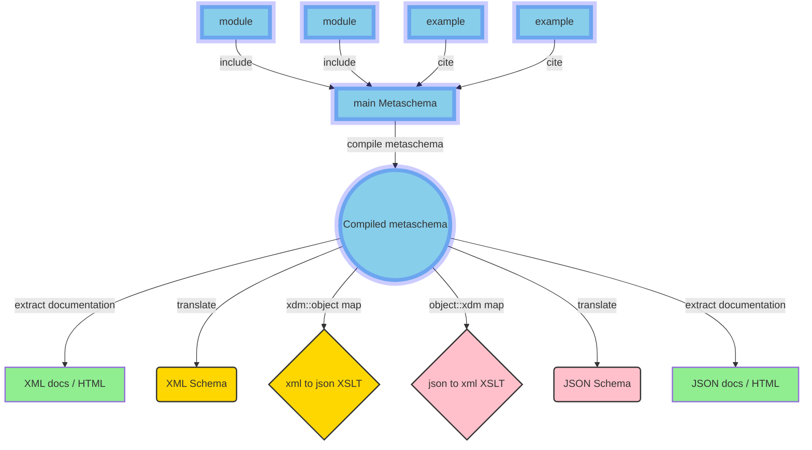

[Mermaid](https://mermaidjs.github.io/) is a notation for producing graphics from abstract node/network descriptions

The following is the Mermaid notation for the chart above:

```mermaid
graph TB
  ms1[module] -- include --> ms
  ms2[module] -- include --> ms
  xmp1[example] -- cite --> ms
  xmp2[example] -- cite --> ms
  ms[main Metaschema] -- compile metaschema --> cms
  cms -- extract documentation --> xmldocsh[XML docs / HTML]
  cms((Compiled metaschema)) -- translate --> sch(XML Schema)
  cms -- xdm::object map --> xj{xml to json XSLT}
  cms -- object::xdm map --> jx{json to xml XSLT}
  cms -- translate --> jsch(JSON Schema)
  cms -- extract documentation --> jsondocsh[JSON docs / HTML]

classDef metasch fill:skyblue,stroke:blue,stroke-width:12px,stroke-opacity:0.2
classDef xml fill:gold,stroke:#333,stroke-width:2px;
classDef json fill:pink,stroke:#333,stroke-width:2px
classDef html fill:lightgreen,stroke-width:2px
classDef md fill:lightgreen,stroke-width:4px,stroke-dasharray:2,2

class cms,ms,ms1,ms2,xmp1,xmp2 metasch
class sch,xj xml
class jsch,jx json
class xmldocsh,jsondocsh html
class xmldocmd,jsondocmd md
```