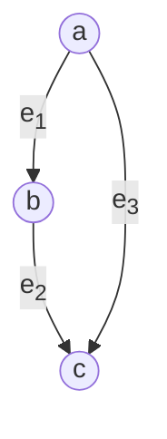
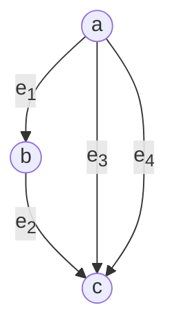
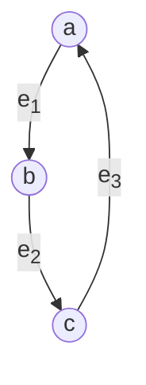
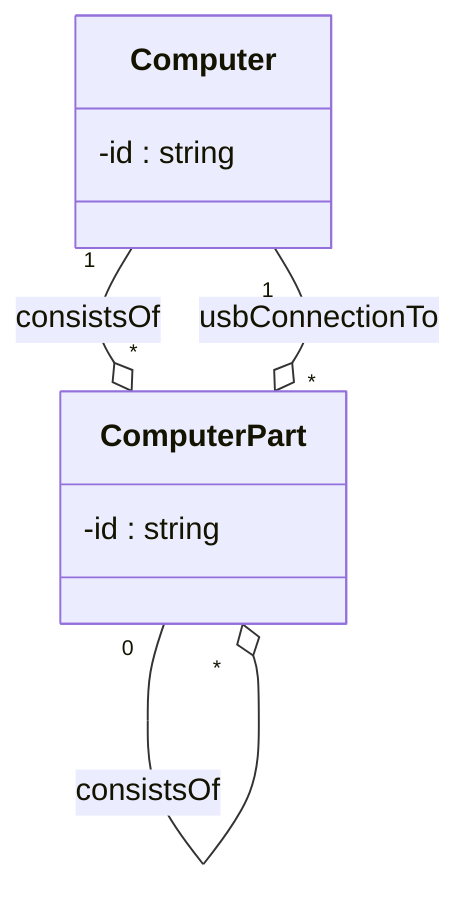
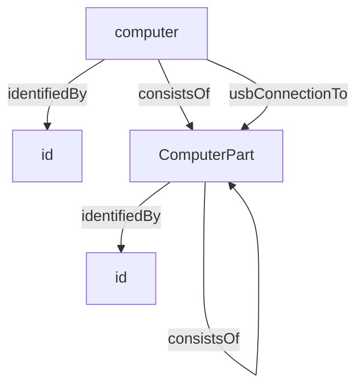
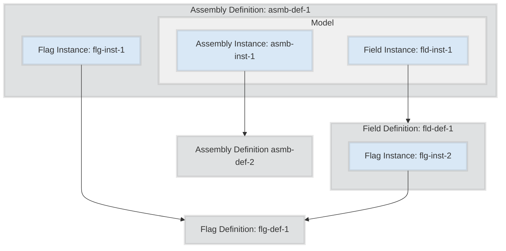

The following diagram illustrates the relationships between information modeling concepts and the core structures provided by the Metaschema Framework.

An [*information model*](/specification/glossary/#information-model) is an abstract representation of information from a given information [*domain*](/specification/glossary/#domain). An *information model* is composed of a set of semantically well-defined information structures that each represent an [*information element*](/specification/glossary/#information-element) in the information domain.

The primary purpose of the Metaschema Framework is to support the structured expression of an information model, which is represented as a [*Metaschema module*](/specification/glossary/#metaschema-module). A Metaschema module is used to represent the whole or a part of a information model for a given information domain in an information-centric, format-neutral form.

## Graph Theoretical Basis of Metaschema

In a *Metaschema module*, an *information model* is represented as a cyclic directed multigraph.

*Information elements* are represented as the *nodes* of the graph, which are connected by *edges* that represent the relationships between *nodes*.

A *Metaschema module* is a *directed graph*, since the *edges* represent a set of ordered node pairs. This allows a *Metaschema module* to represent sequences of relationships. In the example above, `a` has two ordered relationships: <code>a</code> <code>-e1-></code> <code>b</code> and <code>a</code> <code>-e3-></code> <code>c</code>.

A *Metaschema module* is a *multigraph*, since two *nodes* may have multiple edges representing distinct relationships between the two nodes. This allows a *Metaschema module* to represent different relationships between the same two information elements, such as the relationships <code>e3</code> and <code>e4</code> between `a` and `c` below.

A *Metaschema module* is a *cyclic graph*, since a sequence of *nodes* and *edges* can form a circuit where the first and last *nodes* are the same. This allows a *Metaschema module* to represent recursive information structures. This is illustrated below where <code>a</code> <code>-e1-></code> <code>b</code> <code>-e2-></code> <code>c</code> <code>-e3-></code> <code>a</code> form a cycle with node `a` is the first and last node in the cycle.

In a *Metaschema module* a node is represented as a [*definition*](/specification/glossary/#definition). Each *definition* represents a given *information element* in an *information model*. Each *definition* contains data and documentation about the meaning (semantics), structure (syntax), and use of a given *information element*.

In a *Metaschema module* an *edge* is represented as an [*instance*](/specification/syntax/instances/), which establishes a relationship between two *information elements* in an *information model*. Each *instance* contains data and documentation about the relationship, including data about the cardinality, meaning (semantics), structure (syntax), and use of the relationship.

While a *Metaschema module* represents a cyclic directed multigraph, there are a few assumptions that ensure that data representations based on the information model conform to an oriented acyclic directed multigraph. This is necessary to support JSON and XML data representations which use a tree form.

- At least one root node MUST be defined in the *information model*. A root node ensures that orientation is supported, providing a root of the data tree. Multiple root nodes are also possible allowing multiple resulting oriented acyclic directed multigraphs to be produced.
- Nodes involved in a cycle MUST allow for cycle termination. This can be achieved by a zero minimum cardinality on an edge creating a cycle.

## Object-Oriented Basis of Metaschema

In a *Metaschema module*, the cyclic directed multigraph representing an *information model* is represented as a hierarchy using a *compositional* approach to describe *information elements*. This approach aligns well with the hierarchical form of JSON, YAML, and XML; and also supports programming language data structures that are based on object-oriented principles.

In object-oriented programming languages, a *class* can be used to represent an *information element*. An *object* represents a data instance of a *class*, which can also be considered an instantiation of an *information element*. Each composite *member* of a *class* can be used to represent a relationship to an *object* of another class. Thus, a *class member* represents a specific type of relationship between two *information elements*. This compositional form is often referred to as a `has-a` relationship.

For example:

In this example the `Computer` class establishes an aggregate compositional relationship `consistsOf` to a `ComputerPart` class. This is a way of stating that a computer is made up of a set of parts.

In a *Metaschema module*, the *information element* concepts of a `Computer` and a `ComputerPart` can be represented as a *definition*. Thus, a *definition* represents a *class*. The `consistsOf` relationship is represented as an *instance*. Thus, an *instance* represents a *class member*.

The following illustrates how the object-oriented approach used to describe a computer can be represented as a cyclic directed multigraph.

The duality of the *Metaschema module* as both a representation of a cyclic directed multigraph and a set of object-oriented classes is explored in this specification.

# Definitions, Instances, and Local Definitions

Metaschema uses 3 types of [*definitions*](/specification/syntax/definitions/) to represent information elements with different structural shapes: [`define-flag`](/specification/syntax/definitions/#top-level-define-flag), [`define-field`](/specification/syntax/definitions/#top-level-define-field), and [`define-assembly`](/specification/syntax/definitions/#top-level-define-assembly). These *definition* types are used as building blocks of a Metaschema-based model.

*Field definitions* and *assembly definitions* allow the identification of edges through the declaration of an [*instance*](/specification/syntax/instances/). An *instance* represents an edge between the containing definition and another definition. Thus, an *instance* makes use of another definition, typically by reference.

Both field and assembly definitions optionally allow the inclusion of one or more child [*flag instances*](/specification/syntax/instances/#flag-instances).

An assembly definition also has a [complex model](/specification/syntax/definitions/#model) which contains a sequence of [*model instances*](/specification/syntax/instances/#model-instances), each *model instance* is either a [*field instance*](/specification/syntax/instances/#field-instances) or an [*assembly instance*](/specification/syntax/instances/#assembly-instances).


Within a *Metaschema module*, the *information model* implementation consists of assemblies, each of which are composed of more assembly, field, and flag instances. 

*Field instances* and *assembly instances* support the composition of complex *information elements*.

Flag instances may exist on fields and assemblies, providing identifying or qualifying data about their containing definition.

The following example illustrates the use of each type of *definition*, and the use of *flag instances* and *model instances* to create a more complex model through composition.

The example above declares 4 distinct object definitions, along with their instances.

- The *flag definition* `flg-def-1` represents a reusable [*flag*](/specification/glossary/#flag).
- The *field definition* `fld-def-1` represents a reusable [*field*](/specification/glossary/#field).
- The *assembly definitions* `asmb-def-1` and `asmb-def-2` represent reusable [*assemblies*](/specification/glossary/#assembly).

Through the compositional use of *flag instances* and *model instances*, it is possible to build a complex *information element* by declaring how smaller *information elements* are combined together through composition.

In the example above, the *assembly definition* `asmb-def-1` and the *field definition* `fld-def-1` both instantiate the flag defined as `flg-def-1`. These *instances*, `flg-inst-1` and `flg-inst-2` respectively, are examples of *flag instances*. The *assembly definition* `asmb-def-1` declares the *flag instance* `flg-inst-1` as a composite child by referencing the *flag definition* `flg-def-1`. Similarly, the *field definition* `fld-def-1` declares the *flag instance* `flg-inst-2` as a composite child by referencing the *flag definition* `flg-def-1`.

Furthermore, the *assembly definition* `asmb-def-1` has a complex model that instantiates the *assembly definition* `asmb-def-2`, as `asmb-inst-1`, and the *field definition* `fld-def-1`, as `fld-inst-1`. These are examples of *model instances*.


*Assemblies* and *fields* also allow *inline definitions* to be declared which represent a single use *definition* that is also an *instance*. In these cases the inline `<define-flag>`, `<define-field>`, and `<define-assembly>` elements are used, which combine the data elements used to declare a *definition* and *instance* of the same type.
