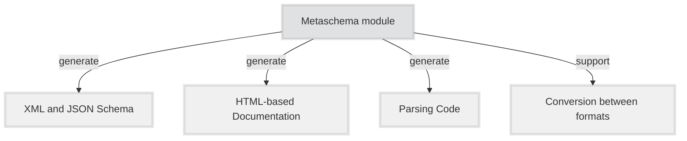

The *Metaschema Modeling Framework* provides a means to represent an [*information model*](/specification/glossary/#information-model) for a given [*information domain*](/specification/glossary/#domain), consisting of many related [*information elements*](/specification/glossary/#information-element), in a *data format* neutral form. By abstracting information modeling away from *data format* specific forms, the Metaschema Modeling Framework provides a means to consistently and sustainably maintain an *information model*, while avoiding the need to maintain each derivative *data format* individually. By consolidating *information model* maintenance into a single representation, significant time can be saved over other approaches that require each *data format* to be maintained individually.

A Metaschema-based *information model* is represented in an abstract XML-based format, called a [*Metaschema module*](/specification/glossary/#metaschema-module). A *Metaschema module* represents implementations of the individual *information elements* of the *information model* using [*definitions*](/specification/glossary/#definition). These *definitions* are bound tightly to representational forms in each supported derivative *data format*, unifying representations for a given information model. Based on the tight binding provided by the Metaschema Modeling Framework, a given *information model* can be used to deterministically generate a [*data model*](/specification/glossary/#data-model) in a *data format* specific form.

The Metaschema framework currently supports XML, JSON, and YAML *data formats*. Support for YAML is limited to the subset of YAML that aligns with JSON representations.

This tight binding to supported derivative data formats has many advantages.

1. **Automated Schema Generation:** Schema representations for a given supported *data format* can be automatically generated from a Metaschema module. A generated schema can be used to validate that data is conformant to the associated *data model*, ensuring that this data is conformant to the *information model* defined by the *Metaschema module*. When the *information model* is changed, an updated schema representation can be automatically generated.
1. **Automated Translation of Content:** Data represented using a *data model* derived from a *Metaschema module* can be automatically translated into an alternate *data model* based on the same *Metaschema module*. This allows data aligned with a derived *data model* to be automatically converted into data representations in all other *data models* derived from the same *Metaschema module*.
1. **Automated Documentation Generation:** *Data model* specific documentation can be automatically generated from a *Metaschema module*. This generated documentation is oriented to the syntax and concepts of the *data format* used by the *data model*, providing a format-specific view of an *information model*.
1. **Automated Parsing Code Generation:** Programming language specific parsing and content generation code can also be automatically generated using a *Metaschema module*, supporting data deserialization and serialization for all derived *data models*. The data structures generated represent the *information model* allowing data read from and written to all derived *data models* to be represented in a singular set of data structures. This generative approach allows application developers to focus right away on business logic and user interface features, instead of building the data structures needed to represent the *data models* for a given *information domain*.

The following illustrates the Metaschema Framework architecture as described above.

These capabilities can be applied to any *information domain*, serving developers who need to support multiple *data models* for a given *information domain* or a format specific technology stack that is well-suited to their application based on a single *data model* equally. In either case, use of the generative capabilities supported by the Metaschema Framework, further reduces the time required to maintain format-specific documentation, schemas, data, and parsing code in one or multiple *data formats*.

This specification provides a basis for the development of interoperable toolchains supporting the generative capabilities of the Metaschema Framework. This specification is also intended to serve as a reference for information modelers producing Metaschema-based *information models*.

## Design Goals

The design of the Metaschema modeling approach addresses the following needs:

1. **Ease Maintenance:** Reduce the implementation burden of supporting multiple *data formats* for a single *information model*, along with documentation, schemas, data, and related tooling.
1. **Ease Format Adoption Costs:** Reduce the cost of adopting a new supported *data format* for use with a given *information model*. As bindings to new *data formats* are supported by the Metaschema Modeling Framework, users of supporting tools gain use of the new *data format*.
1. **Unified Format Support:** Unify support for compatible data descriptions in multiple *data formats*, such as XML, JSON, YAML and potentially others over time. For a given *information model* data can be easily translated between *data models* in all supported *data formats*.
1. **Ease Production of Data Format Documentation:** Produce *data model* documentation from the same source as schema files and associated tools.
1. **Promote Information Model Experimentation:** Enable distributed, semi-coordinated experimentation around information concepts within a given *information domain*. *Information elements* can be easily added, modified, and removed. Documentation, schemas, and tools can be quickly updated using automated generative tools supported by a given *Metaschema module*.

## Design Approach

The Metaschema Modeling Framework provides a reduced, lightweight modeling language with constraints that apply at the level of the information model abstraction.

The following philosophy was used in the current design:

- **Mediate Format Structural Differences:** Mediate between the structural differences in the XML, JSON, and YAML *data formats* by providing format-specific tailoring capabilities that improve the expression and conciseness of Metaschema-based data in a given format. This has the added benefit of making Metaschema easier to learn and use over learning the idiosyncrasies of each *data format*.
- **Capitalize on Format Features:** To the extent possible, maximize the use of *data format*-specific features, while still aligning modeling functionality across all supported *data formats*. In some cases, support for specific *data format* and schema features may be omitted where these features do not align well across all supported *data formats*.
- **Unify Information Modeling Across Formats:** Use modeling constructs that map cleanly into features offered by XML and JSON schema technologies. This ensures that all information can be preserved, without data loss in bidirectional conversion.
- **Reduce Runtime Complexities:** Eliminate the need for additional inputs, reliance on arbitrary conventions, or runtime settings to reliably produce correspondent XML, JSON or YAML from any other supported *data format*.
- **Focus on Running Code:** Focus on the production of a rich specification that facilitates running code supporting automated generation of schemas, documentation, tooling, and other model-related artifacts consistent with the *information model* defined and documented by a given *Metaschema module*.
