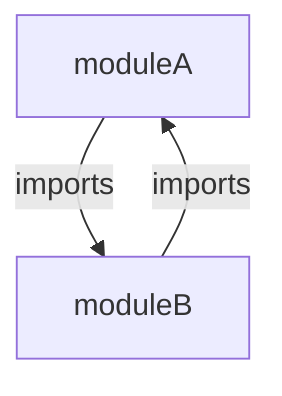

A *Metaschema module* is represented using the top-level XML element `<METASCHEMA>`.

For example:

```xml
<?xml version="1.0" encoding="UTF-8"?>
<METASCHEMA xmlns="http://csrc.nist.gov/ns/oscal/metaschema/1.0">
  <schema-name>Computer Model</schema-name>
  <schema-version>0.0.5</schema-version>
  <short-name>computer</short-name>
  <namespace>http://example.com/ns/computer</namespace>
  <json-base-uri>http://example.com/ns/computer</json-base-uri>
  <remarks>
    <p>This is an example model to describe the components of a computer.</p>
    <p>The "computer" element is the root element of this model.</p>
  </remarks>
  <!-- followed by a series of imports, then a series of definitions -->
</METASCHEMA>
```

Attributes:

| Attribute | Data Type | Use      | Default Value | Section |
|:---       |:---       |:---      |:---           |:---      |
| [`@abstract`](#abstract-modules) | `yes` or `no` | optional | `no` | Header: [Abstract Module](#abstract-modules) |

Elements:

| Element | Data Type | Use      | Section |
|:---       |:---       |:---      |:---      |
| [`<schema-name>`](#schema-name) | [`markup-line`](/specification/datatypes/#markup-line) | 1 | Header: [Documentation](#module-documentation) |
| [`<schema-version>`](#schema-version) | version ([`string`](/specification/datatypes/#string)) | 1 | Header: [Documentation](#module-documentation) |
| [`<short-name>`](#short-name) | [`token`](/specification/datatypes/#token) | 1 | Header: [Documentation](#module-documentation) |
| [`<namespace>`](#xml-namespace) | [`uri`](/specification/datatypes/#uri) | 1 | Header: [XML Namespace](#xml-namespace) |
| [`<json-base-uri>`](#json-base-uri) | [`uri`](/specification/datatypes/#uri) | 1 | Header: [JSON Base URI](#json-base-uri) |
| [`<remarks>`](#remarks) | special | 0 or 1 | Header: [Documentation](#module-documentation) |
| [`<import>`](#import) | special | 0 to ∞ | [Module Imports](#import) |
| [`<define-assembly>`](/specification/syntax/definitions/#top-level-define-assembly),<br/>[`<define-field>`](/specification/syntax/definitions/#top-level-define-field), and<br/>[`<define-flag>`](/specification/syntax/definitions/#top-level-define-flag) | special | 0 to ∞ | [Module Definitions](/specification/syntax/definitions/) |

The first set of elements in a *Metaschema module* represent the *header*, which contains information about the *Metaschema module* as a whole. The remainder of this section discusses the use of these elements.


**Note:** There is no explicit separation between the *header* and the *definitions* in a *Metaschema module*. The header ends where the [`<import>`](#import), [`<define-assembly>`](/specification/syntax/definitions/#top-level-define-assembly), [`<define-field>`](/specification/syntax/definitions/#top-level-define-field), and [`<define-flag>`](/specification/syntax/definitions/#top-level-define-flag) elements first appear.


## Module Documentation

Top-level documentation for the *Metaschema module* appears in the the *header* section.


The documentation within the *header* applies to the whole *Metaschema module*. Each child object *definition* will also have associated documentation that appears within that object's declaration.


The *header* may include the following elements, in order:

## Abstract Modules

The optional `@abstract` attribute indicates if the *Metaschema module* is intended to be used on its own or only for import into another *Metaschema module*.

The following values describe the intent of `@abstract` attribute.

- `no` - Indicates that the *Metaschema module* is usable on its own. This is the default behavior when `@abstract` is not declared.
- `yes` - Indicates that the *Metaschema module* is not usable on its own. Instead, the *Metaschema module* SHOULD only be *imported* by other Metaschema modules.


It's a best practice to mark *Metaschema modules* that are intended only for reuse in other *Metaschema modules* as `@abstract=yes`. This communicates to users of the module that the module is not standalone.


For example:

```xml {linenos=table,hl_lines=[3]}
<?xml version="1.0" encoding="UTF-8"?>
<METASCHEMA xmlns="http://csrc.nist.gov/ns/oscal/metaschema/1.0"
  abstract="yes">
  <!-- ... other content ... -->
</METASCHEMA>
```

### `<schema-name>`

The required `<schema-name>` is a line of [structured markup](/specification/datatypes/#markup-line) that provides a human-readable name, suitable for display, for the *information model* represented by this *Metaschema module*.

For example:

```xml
<schema-name>Computer Model</schema-name>
```

### `<schema-version>`

A required, unique string literal value indicating the distinct version assigned to the *Metaschema module*.

This version MUST provide a means to distinctly identify a given revision of the *Metaschema module* in a series of revisions. The value child of the `<schema-version>` SHOULD be a [semantic version](https://semver.org/), which allows for automatically determining if a given version precedes, matches, or succeeds another version.


Use of [semantic versioning](https://semver.org/), also referred to as "semver", in a `<schema-version>` is encouraged, since semver provides a standardized set of rules for how version numbers are assigned and incremented. This allows computation over version ranges and comparison of individual versions.


For example:

```xml
<schema-version>0.0.5</schema-version>
```

This example defines a semantic version with a major version of `0`, a minor version of `0`, and a patch version of `5`.

### `<short-name>`

A required, unique string literal value that identifies a series of revisions of the *Metaschema module*. Each revision in the series will have the same `<short-name>`.

For example:

```xml
<short-name>computer</short-name>
```

Together, the `<short-name>` and `<schema-version>` provide an identification pair that uniquely identifies a given *Metaschema module* revision. This pair of values is intended to be associated with any schemas, code, tools, or other derivative artifacts produced from the *Metaschema module*, providing for clear identification of the revision from which an artifact is derived.

### `<remarks>`

An optional sequence of [multiline markup](/specification/datatypes/#markup-multiline) used to provide additional supporting notes related to the *Metaschema module*.

A `<remarks>` element is typically used to include explanatory commentary of any kind.

For example:

```xml
<remarks>
  <p>This is an example model to describe the components of a computer.</p>
  <p>The "computer" element is the root element of this model.</p>
</remarks>
```


As a general purpose element, the `<remarks>` element is also permitted to appear elsewhere in the *Metaschema module* model. Its scope of application is tied to the location of use in the document. Thus, the top-level remarks relate to the entire *Metaschema module*, while remarks on a *definition* relate to the *definition*.


## XML `<namespace>`

The required `<namespace>` element is a [uniform resource identifier](https://www.rfc-editor.org/rfc/rfc3986) (URI) that identifies the [XML Namespace](https://www.w3.org/TR/xml-names/#sec-namespaces) to use for XML instances of the model.

All *information elements* defined in the *Metaschema module* will be assigned to this namespace when handling related XML data.


Note: *Information elements* defined in an [imported *Metaschema module*](#import), will be assigned the namespace declared in that module's header. This makes it possible to use and differentiate *information elements* defined with different namespaces.


The XML namespace defined using this element will be the target namespace used in an XML schema generated from this *Metaschema module*.

## `<json-base-uri>`

The required `<json-base-uri>` element is a [uniform resource identifier](https://www.rfc-editor.org/rfc/rfc3986) (URI) that identifies the URI used in the [`$schema` keyword](https://datatracker.ietf.org/doc/html/draft-handrews-json-schema-01#section-7) in JSON Schemas generated from this *Metaschema module*.

## `<import>`

The `<import>` element is used to import the definitions defined in another Metaschema module for use in the importing Metaschema module.

An import cycle occurs when a *Metaschema module* imports itself directly or transitively.

An example scenario is illustrated below.



In this example a cycle is created `A -> B -> A`.

When processing imports, an implementation MUST be capable of detecting and generating a fatal error when an import cycle is found.

## Definition Name Resolution

The [top-level *definition* names](/specification/syntax/definitions/#name) exported by a *Metaschema module* are controlled by the top-level *definition's* [`@scope`](/specification/syntax/definitions/#scope) attribute. Definitions with a given *Metaschema module* without an explicit `@scope` or with `@scope="global"` are exported for use by other *Metaschema modules* that import it directly or transitively. The possibility of name conflicts arises when two modules have different definitions of the same type (i.e. flag, field, assembly) with the same name, and these modules are both imported.

The following rules MUST be applied to resolve naming conflicts that arise from [module imports](#import).

1. A *definition* MUST be considered for import if the *definition* is in an [imported module](#import), and it either has no [`@scope`](/specification/syntax/definitions/#scope) or `@scope="global"`. A *definition* with `@scope="local"` MUST be ignored.
1. When a *definition* of a given type is imported, if its name matches the name of a previously imported *definition* of the same type, the most recently imported *definition* MUST be used.
1. If a *definition* of a given type exists in the importing *Metaschema module* that matches the name of a previously imported *definition* of the same type, the definition in the importing *Metaschema module* MUST be used.
1. Each module uses the resulting set of named *definitions* to resolve references within the module.

The following example illustrates how scoping affects definition name resolution.

The following file is the `shadow-imported_metaschema.xml`.
```xml {linenos=table,hl_lines=[8,12,"20-24"]}
<?xml version="1.0" encoding="UTF-8"?>
<METASCHEMA xmlns="http://csrc.nist.gov/ns/oscal/metaschema/1.0">
    <schema-name>Imported Metaschema</schema-name>
    <schema-version>1.0</schema-version>
    <short-name>imported</short-name>
    <namespace>http://csrc.nist.gov/ns/metaschema/example/1.0</namespace>

    <define-assembly name="imported-flags" scope="global">
        <formal-name>Assembly that includes global and local flags</formal-name>
        <description>This assembly references a global flag that is shadowed by a global flag defined
          in the importing metaschema module.</description>
        <flag ref="global-flag">
            <remarks>
                <p>This reference should be to the globally scoped flag "global-flag" from the imported
                  metaschema module.</p>
            </remarks>
        </flag>
    </define-assembly>
    
    <define-flag name="global-flag" scope="global">
        <formal-name>Global Flag - Imported Metaschema</formal-name>
        <description>A flag from the imported metaschema. Its scope is global and it's shadowed by the
          definition with the same name in the importing metaschema module.</description>
    </define-flag>
</METASCHEMA>
```

This file declares the globally scoped *assembly definition* named `imported-flags` (on line 8), which references the global scoped *flag definition* `global-flag` (on line 12). It also declares the globally scoped *flag definition* named `global-flag` (on line 20).

The following file is the `shadow-importing_metaschema.xml`.
```xml {linenos=table,hl_lines=[8,10,15,"32-35"]}
<?xml version="1.0" encoding="UTF-8"?>
<METASCHEMA xmlns="http://csrc.nist.gov/ns/oscal/metaschema/1.0">
    <schema-name>Importing Metaschema</schema-name>
    <schema-version>1.0</schema-version>
    <short-name>importing</short-name>
    <namespace>http://csrc.nist.gov/ns/metaschema/example/1.0</namespace>

    <import href="shadow-imported_metaschema.xml"/>

    <define-assembly name="importing-A">
        <formal-name>Assembly that global flags</formal-name>
        <description>This assembly references a global flag that shadows a global flag defined in an
          imported metaschema module.</description>
        <root-name>including-flags</root-name>
        <flag ref="global-flag">
            <remarks>
                <p>This reference is to the globally scoped flag "global-flag" from the importing
                  metaschema. This definition is taking precedence over the other definition imported
                  (with the same name).</p>
            </remarks>
        </flag>
        <model>
            <assembly ref="imported-flags">
                <remarks>
                    <p>This is the imported "imported-flags" assembly, complete with its full model
                      from the imported metaschema module, including the global-flag defined there.</p>
                </remarks>
            </assembly>
        </model>
    </define-assembly>
    
    <define-flag name="global-flag">
        <formal-name>Global Flag - Importing Metaschema</formal-name>
        <description>A flag from the importing metaschema. Its scope is global. This should be marked
          as a shadowing of another imported flag.</description>
    </define-flag>
</METASCHEMA>
```

This file imports the `shadow-imported_metaschema.xml` (on line 8). It also declares a global scoped *assembly definition* named `importing-A` (on line 10), which references the *flag definition* `global-flag` (on line 15). It also declares the globally scoped *flag definition* named `global-flag` (on line 32).

Both files contain globally scoped *flag definitions* named `global-flag`.

According to the rules above, the following is true.

- The assembly named `imported-flags` uses the flag named `global-flag` from the `shadow-imported_metaschema.xml`. This is because definitions names are resolved in the local context of each model.
- The assembly named `importing-A` uses the flag named `global-flag` from the `shadow-importing_metaschema.xml`. This is because definitions declared in the current module shadow imported definitions.
