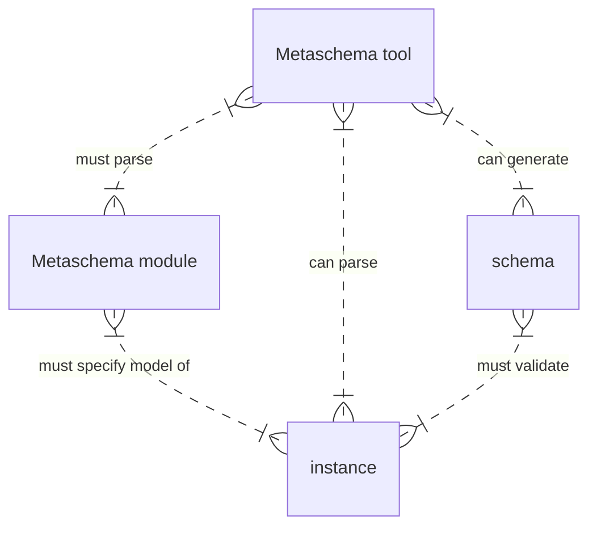

Metaschema is a framework for consistently organizing information into machine-readable data formats. For example, if we want to build tools to exchange information about computers, how do we represent a computer in a data format? How do we design it to be consistent and reusable across different software? How do we benefit from the right amount of structured information about computers in that format?

## Understanding the Domain and Designing the Model

To start organizing this computer information consistently, we need to consider our mental model of what a computer is. We have to think of the different parts of a computer, sub-parts, and how to compose those parts into a whole. Let's consider a computer such as one visualized below.


Source: [Wikipedia](https://commons.wikimedia.org/wiki/File:Personal_computer,_exploded_5,_unlabeled.svg)

Based on this picture, the knowledge [domain](/specification/glossary/#domain) we want to describe is information about the components of a personal computer. We need to design an [information model](/specification/glossary/#information-model) that can sufficiently describe the necessary information in this domain. At the core of this information model, we have the concept of a personal computer, which represents the root [information element](/specification/glossary/#information-element) of the information model. Our design process will focus around this domain, developing an information model focused on the personal computer and all related information elements that describe the parts and sub-parts of a computer.

We then want to represent this computer information model in one or more concrete data models that are aligned with commonly used data formats like JSON, XML, and YAML.

Once we understand the required information structure for a computer, how do we specify a model in Metaschema and what are the benefits of using a Metaschema-based approach to move towards a set of equivalent data models?

## Metaschema Concepts

Metaschema helps developers to define information models once as a [Metaschema module](../../specification/glossary/#metaschema-module). A Metaschema module specifies the information elements of the information model and how that model is represented in supported machine-readable data formats (i.e. JSON, YAML, XML), which we call a [data model](/specification/glossary/#data-model). A document in such a format is an instance of that module. A schema can be used to check that a document is well-formed and valid against the model represented by the format. Such schemas can be derived deterministically and programmatically from a Metaschema module (or "metaschema").



## Basic Modeling and Basic Metaschema Module

We start with an empty Metaschema module, like the one below, saved in a file called `computer_metaschema.xml`.

```xml
<?xml version="1.0" encoding="UTF-8"?>
<METASCHEMA xmlns="http://csrc.nist.gov/ns/oscal/metaschema/1.0">
</METASCHEMA>
```

Metschema modules, like the one above, are expressed in XML. A module begins and ends with capitalized `METASCHEMA` tags. This module is an empty file, which means it is not a valid, well-formed module, since it lacks any of the required data elements. It is simply the base we will start with. Within the beginning and ending tags, we want to add the required and useful metadata needed for both developers and Metaschema-enabled tools to consume this module. We do this below.

```xml {linenos=table,hl_lines=["3-7"]}
<?xml version="1.0" encoding="UTF-8"?>
<METASCHEMA xmlns="http://csrc.nist.gov/ns/oscal/metaschema/1.0">
  <schema-name>Computer Model</schema-name>
  <schema-version>0.0.1</schema-version>
  <short-name>computer</short-name>
  <namespace>http://example.com/ns/computer</namespace>
  <json-base-uri>http://example.com/ns/computer</json-base-uri>
  <define-assembly name="computer"/>
</METASCHEMA>
```

The metadata above provides the useful information needed by us: Metaschema developers and our tools that parse Metaschema modules. The `<schema-name>` is the long-form, descriptive name of the computer model. The `<schema-version>` gives the model itself a version number signifying the iterative instance of the model, for both developers or their tools to use. The `<short-name>` is the shortened form of the `schema-name`, which provides a human-readable identifier for the model. Normally, Metaschema-enabled tools will parse or generate data with this name `computer`, not `Computer Model`. The `namespace` is a URI used to identify the model and its parts as belonging to a single scope for XML data and schemas. Similarly, the `json-base-uri` serves a similar purpose for JSON and YAML data, and JSON schemas.

It is important to note this module is just a starting point. This module is the most minimally viable module possible: it is well-formed and valid against [the XML Schema for the Metaschema syntax itself](https://github.com/usnistgov/metaschema/blob/develop/schema/xml/metaschema.xsd), but Metaschema-enabled tools should consider this an empty module, since we have not yet declared a complete implementation of an information element yet.

So let's start defining the "computer" information element. We will begin by designing a computer object to have just an identifier. 

We will add an `id` flag, that represents the computer's identifier, to the `<define-assembly>` definition named `computer`.

```xml {linenos=table,hl_lines=["9-17"]}
<?xml version="1.0" encoding="UTF-8"?>
<METASCHEMA xmlns="http://csrc.nist.gov/ns/oscal/metaschema/1.0">
  <schema-name>Computer Model</schema-name>
  <schema-version>0.0.2</schema-version>
  <short-name>computer</short-name>
  <namespace>http://example.com/ns/computer</namespace>
  <json-base-uri>http://example.com/ns/computer</json-base-uri>
  <define-assembly name="computer">
    <formal-name>Computer Assembly</formal-name>
    <description>A container object for a computer, its parts, and its
      sub-parts.</description>
    <root-name>computer</root-name>
    <define-flag name="id" as-type="string" required="yes">
        <formal-name>Computer Identifier</formal-name>
        <description>An identifier for classifying a unique make and model of
          computer.</description>
    </define-flag>
  </define-assembly>
</METASCHEMA>
```

With the definition of the first `<define-assembly>`, representing a simple computer information element, our Metaschema module starts to take shape.

In the `<define-assembly>` declaration we have defined an object named `computer` (see line 8).

The computer object must have an `id`, the value of which must be [`string`](/specification/datatypes/#string) (see lines 12-15).

The `<root-name>` element is used to identify to Metaschema-enabled tools that this assembly is allowed to be the root element of our data model (see line 11). This will come in handy later.

With Metaschema-enabled tooling, we can now represent information about a computer in the respective JSON, XML, and YAML data formats. The following are equivalent content examples for the model above using JSON, XML, and YAML.


{}

{
  "computer": {
    "id": "awesomepc1"
  }
}

{}
{}

<?xml version="1.0" encoding="UTF-8"?>
<computer xmlns="http://example.com/ns/computer" id="awesomepc1"/>

{}
{}

---
computer:
  id: awesomepc1

{}


At this point, we have our first functional and complete Metaschema definition and some basic content instance examples that are aligned with the model we have designed so far. Metaschema-enabled tools ought to be able to parse this module and use it to parse the content instances immediately above, as specified based on this module.

## Assemblies, Fields, and Flags

It is important to have a computer with an identifier, but our stakeholders want far more. Using metaschema, we can add a `field` or `flag` for simple key-value properties on a computer, and an `assembly` for more complex objects.

To explore and understand these concepts, we need to continue our design work on the computer model. We return to modeling once again.

Let's return to the diagram of the computer from before, but now consider how we might model the parts of a computer, the sub-parts, and their relationships. Our stakeholders provided us this diagram, and these are the key data points they need our software to process and store.


Source: [Wikipedia](https://upload.wikimedia.org/wikipedia/commons/1/13/Personal_computer%2C_exploded_4.svg)

Below are the parts and sub-parts our stakeholders want in our information model of a computer based on the diagram.

1. Display
1. Motherboard
1. CPU
1. ATA socket
1. Memory
1. Expansion card(s)
1. CD/DVD drive
1. Power supply unit
1. Hard disk
1. Keyboard
1. Mouse

When we consider the parts and sub-parts, we recognize some hierarchical relationships, represented below in outline form.

- Display
- Motherboard
  - CPU
  - ATA socket
  - Memory
  - Expansion cards
- CD/DVD drive
- Power supply unit
- Hard disk
- Keyboard
- Mouse

After discussion with our stakeholders, there is agreement we need to structure additional information about computers, parts, and sub-parts as well.

- **Computer**
  - **Vendor information:** incorporation name; office address; product website
  - **Display:** product name; display type
  - **Motherboard**: product name; type
    - **CPU:** product name; architecture; clock speed
    - **ATA socket:** product name; ATA socket type
    - **Memory:** product name; size in bytes
    - **Expansion cards:** product name; type
  - **CD/DVD drive:** product name; type
  - **Power supply unit:** product name; wattage; type
  - **Hard disk:** product name; capacity; type
  - **Keyboard:** product name; type
  - **Mouse:** product name; type

With this outline, we acknowledge the need for a hierarchy, which will impact how we design the managed objects of a computer, especially the motherboard.

How can we use Metaschema to encode these hierarchies across data formats? We use assemblies, and within those assemblies, fields and flags in a particular order.

With an `assembly`, we can specify a complex named object, not just a simple key-value pair. We can annotate this complex named object itself with `flag`s. The object we specify in the assembly can have optional key-values, which we define with `field`s. Using these Metaschema concepts, we can enhance the `computer` model to include an `assembly` for a motherboard and include its sub-parts like so.

```xml {linenos=table,hl_lines=["16-113"]}
<?xml version="1.0" encoding="UTF-8"?>
<METASCHEMA xmlns="http://csrc.nist.gov/ns/oscal/metaschema/1.0">
  <schema-name>Computer Model</schema-name>
  <schema-version>0.0.3</schema-version>
  <short-name>computer</short-name>
  <namespace>http://example.com/ns/computer</namespace>
  <json-base-uri>http://example.com/ns/computer</json-base-uri>
  <define-assembly name="computer">
    <formal-name>Computer Assembly</formal-name>
    <description>A container object for a computer, its parts, and its sub-parts.</description>
    <root-name>computer</root-name>
    <define-flag name="id" as-type="string" required="yes">
        <formal-name>Computer Identifier</formal-name>
        <description>An identifier for classifying a unique make and model of computer.</description>
    </define-flag>
    <model>
      <define-assembly name="vendor">
        <formal-name>Vendor Information</formal-name>
        <description>Information about a vendor of a computer part.</description>
        <define-flag name="id" as-type="string" required="yes">
          <formal-name>Vendor Identifier</formal-name>
          <description>An identifier for classifying a unique computer parts vendor.</description>
        </define-flag>
        <model>
          <define-field name="name" min-occurs="1" max-occurs="1">
            <formal-name>Vendor Name</formal-name>
            <description>The registered company name of the vendor.</description>
          </define-field>
          <define-field name="address" min-occurs="1" max-occurs="1">
            <formal-name>Vendor Address</formal-name>
            <description>The physical address of an office location for the vendor.</description>
          </define-field>
          <define-field name="website" as-type="uri" min-occurs="1" max-occurs="1">
            <formal-name>Vendor Website</formal-name>
            <description>A public website made by the vendor documenting their parts as used in the computer.</description>
          </define-field>
        </model>
      </define-assembly>
      <define-assembly name="motherboard">
        <formal-name>Motherboard Assembly</formal-name>
        <description>A container object for a motherboard in a computer and its sub-parts.</description>
        <model>
          <define-field name="product-name" as-type="string" min-occurs="1" max-occurs="1">
            <formal-name>Product Name</formal-name>
            <description>The product name from the vendor of the computer part.</description>
          </define-field>
          <define-field name="type" as-type="string" min-occurs="1" max-occurs="1">
            <formal-name>Motherboard Type</formal-name>
            <description>The type motherboard layout, <code>at</code>, <code>atx</code>, <code>mini-itx</code> or an alternative.</description>
          </define-field>
          <define-assembly name="cpu">
            <formal-name>Motherboard Central Processing Unit (CPU)</formal-name>
            <description>The model number of the CPU on the motherboard of a computer.</description>
            <model>
              <define-field name="product-name" as-type="string" min-occurs="1" max-occurs="1">
                <formal-name>Product Name</formal-name>
                <description>The product name from the vendor of the computer part.</description>
              </define-field>
              <define-field name="architecture" as-type="string" min-occurs="1" max-occurs="1">
                <formal-name>CPU Architecture</formal-name>
                <description>The Instruction Set Architecture (ISA) of the processor, <code>x86</code>, <code>x86-64</code>, <code>arm</code>, or an alternative.</description>
              </define-field>
              <define-field name="speed" as-type="string" min-occurs="1" max-occurs="1">
                <formal-name>CPU Speed</formal-name>
                <description>The clock speed of the CPU in megahertz or gigahertz.</description>
              </define-field>
            </model>
          </define-assembly>
          <define-assembly name="ata-socket">
            <formal-name>Motherboard Advanced Technology Attachment (ATA) Socket</formal-name>
            <description>The model number of ATA socket on the motherboard of a computer. There will only be one socket on any motherboard.</description>
            <model>
              <define-field name="product-name" as-type="string" min-occurs="1" max-occurs="1">
                <formal-name>Product Name</formal-name>
                <description>The product name from the vendor of the computer part.</description>
              </define-field>
              <define-field name="type" as-type="string" min-occurs="1" max-occurs="1">
                <formal-name>ATA Socket Type</formal-name>
                <description>The type of ATA socket on the motherboard , <code>pata</code> (parallel ATA), <code>sata</code> (Serial ATA), or an alternative.</description>
              </define-field>
            </model>
          </define-assembly>
          <define-assembly name="memory" min-occurs="1" max-occurs="unbounded">
            <formal-name>Motherboard Random Access Memory (RAM) Module(s)</formal-name>
            <description>Random access memory hardware installed on the motherboard of a computer.</description>
            <group-as name="memory-modules" in-json="ARRAY"/>
            <model>
              <define-field name="product-name" as-type="string" min-occurs="1" max-occurs="1">
                <formal-name>Product Name</formal-name>
                <description>The product name from the vendor of the computer part.</description>
              </define-field>
              <define-field name="byte-size" as-type="positive-integer" min-occurs="1" max-occurs="1">
                <formal-name>Memory Module Size</formal-name>
                <description>Size of the memory module in binary, not SI base-10 units, meaning a kilobyte is 1024 bytes, not 1000 bytes.</description>
              </define-field>
            </model>
          </define-assembly>
          <define-assembly name="expansion-card" min-occurs="0" max-occurs="unbounded">
            <formal-name>Motherboard Expansion Card</formal-name>
            <description>The model number of an expansion card connected to the motherboard of a computer.</description>
            <group-as name="expansion-cards" in-json="ARRAY"/>
            <model>
              <define-field name="product-name" as-type="string" min-occurs="1" max-occurs="1">
                <formal-name>Product Name</formal-name>
                <description>The product name from the vendor of the computer part.</description>
              </define-field>
              <define-field name="type" as-type="string" min-occurs="1" max-occurs="1">
                <formal-name>Expansion Card Type</formal-name>
                <description>The type of expansion card on a motherboard of a computer, such as <code>pci</code> (PCI, e.g. Peripheral Component Interconnect), <code>pcie</code> (PCI Express), or an alternative.</description>
              </define-field>
            </model>
          </define-assembly>
        </model>
      </define-assembly>
    </model>
  </define-assembly>
</METASCHEMA>
```

We now have a nested `motherboard` assembly in a `computer` assembly with assorted flags and fields to present the important hierarchy of information related to the motherboard. With this more detailed model, we can have our Metaschema-enabled tools parse or generate content instances.

The following are example content instances for the model above in JSON, XML, and YAML data formats.


{}

{
  "computer": {
    "id": "awesomepc1",
    "vendor": {
      "id": "vendor1",
      "name": "AwesomeComp Incorportated",
      "address": "1000 K Street NW Washington, DC 20001",
      "website": "https://example.com/awesomecomp/awesomepc1/details"
    },
    "motherboard": {
      "product-name": "ISA Corp Magestic Model M-Ultra Motherboard",
      "type": "atx",
      "cpu": {
        "product-name": "ISA Corp Superchip Model 1 4-core Processor",
        "architecture": "x86-64",
        "speed": "4.7 gigahertz"
      },
      "ata-socket": {
        "product-name": "ISA Corp SuperSATA Model 2 Storage Socket",
        "type": "sata"
      },
      "memory-modules": [
        {
          "product-name": "Massive Memory Corp Model 3 DDR4-3200 8GB (Module 1)",
          "byte-size": 8589934592
        },
        {
          "product-name": "Massive Memory Corp Model 3 DDR4-3200 8GB (Module 2)",
          "byte-size": 8589934592
        }
      ]
    }
  }
}

{}
{}

<?xml version="1.0" encoding="UTF-8"?>
<computer xmlns="http://example.com/ns/computer" id="awesomepc1">
  <vendor id="vendor1">
    <name>AwesomeComp Incorportated</name>
    <address>1000 K Street NW Washington, DC 20001</address>
    <website>https://example.com/awesomecomp/awesomepc1/details</website>
  </vendor>
  <motherboard>
    <product-name>ISA Corp Magestic Model M-Ultra Motherboard</product-name>
    <type>atx</type>
    <cpu>
      <product-name>ISA Corp Superchip Model 1 4-core Processor</product-name>
      <architecture>x86-64</architecture>
      <speed>4.7 gigahertz</speed>
    </cpu>
    <ata-socket>
      <product-name>ISA Corp SuperSATA Model 2 Storage Socket</product-name>
      <type>sata</type>
    </ata-socket>
    <memory>
      <product-name>Massive Memory Corp Model 3 DDR4-3200 8GB (Module 1)</product-name>
      <byte-size>8589934592</byte-size>
    </memory>
    <memory>
      <product-name>Massive Memory Corp Model 3 DDR4-3200 8GB (Module 2)</product-name>
      <byte-size>8589934592</byte-size>
    </memory>
  </motherboard>
</computer>

{}
{}

---
computer:
  id: awesomepc1
  vendor:
    id: vendor1
    name: AwesomeComp Incorportated
    address: 1000 K Street NW Washington, DC 20001
    website: https://example.com/awesomecomp/awesomepc1/details
  motherboard:
    product-name: ISA Corp Magestic Model M-Ultra Motherboard
    type: atx
    cpu:
      product-name: ISA Corp Superchip Model 1 4.7 GHz 4-core Processor
      architecture: x86-64
      speed: 4.7 gigahertz
    ata-socket:
      product-name: ISA Corp SuperATA Model 2 Socket for SATA Drive
      type: sata
    memory-modules:
    - product-name: Massive Memory Corp Model 3 8GB DDR4-3200 (Module 1)
      size: 8589934592
    - product-name: Massive Memory Corp Model 3 8GB DDR4-3200 (Module 2)
      size: 8589934592

{}


With the expressive power of flags, fields, and assemblies, we can specify complex managed objects that implement the information elements of the intended information model. We can also use this expressive power to control the structure of the information in the resulting data formats.

Our Metaschema-enabled tools can parse and generate the different data formats based on this single `computer` Metaschema module. We specify flags on the `computer` assembly, but all else we define in the `<model>` of the `<define-assembly>`. And within that model, we can define the `motherboard` assembly inline with its own flags and model. These abstract definitions, along with information we provide with them, such as names of groups, enables a Metaschema-enabled tool to sort out and distinguish the data points as we wish them to appear in each supported data model. A JSON schema can describe a JSON format that is idiomatic in JSON, while an XML Schema can do the same in XML with the same Metaschema model. As this example demonstrates, Metaschema allows developers to render the data independent of the notation used to represent it, and convert into any other notation their tools to support.

We define the data types for different Metaschema fields and flags. Our Metaschema-enabled tools can leverage [pre-compiled schemas](/specification/datatypes/#data-type-schema-representations) or generate their own to enforce field and flag values that are valid for their type. For example, our Metaschema-enabled tools should accept a valid URI for the `website` field of the `vendor` assembly, but not any arbitrary string. This is accomplished using the [`uri`](/specification/datatypes/#uri) data type. For `byte-size`, they should only accept positive integer values greater than 0, not a decimal point number or string, based on the [`positive-integer`](/specification/datatypes/#positive-integer) data type. Metaschema facilitates consistent enforcement of data typing so we developers do not have to.

We also define the minimum and maximum number of elements for the different assemblies, flags, and field with `@min-occurs` and `@max-occurs` declarations. In our example, we have an optional `expansion-card` field in the `motherboard` assembly. Our Metaschema-enabled tools will parse or generate instances as valid with optional fields missing. On the other hand, a `motherboard` assembly missing the `cpu` field should throw errors, as should parsing or generating instances with one that one `cpu` field in the JSON, XML, or YAML formats.

## Refactoring Metaschema Definitions and Deduplicating Code

We now have a robust information model for a computer we can express in JSON, XML, and YAML formats. But what if we want to enhance the information model? Can we add more information but also refactor the Metaschema module to be more expressive while reducing redundancy? With Metaschema, yes we can.

Our stakeholders determine supply chain information is very important to them. We need to express vendor information for all the different parts of the computer, specifically a company name and where the company is headquartered. This information should be maintained for not just the `computer` information element, but also for all parts and sub-parts.

How can we add this to the Metaschema module?

For now, we can copy-paste the `vendor` assembly into all relevant assemblies, not just the top-level `computer` assembly.

```xml {linenos=table,hl_lines=["43-64","77-98","117-138","154-175","191-212"]}
<?xml version="1.0" encoding="UTF-8"?>
<METASCHEMA xmlns="http://csrc.nist.gov/ns/oscal/metaschema/1.0">
  <schema-name>Computer Model</schema-name>
  <schema-version>0.0.4</schema-version>
  <short-name>computer</short-name>
  <namespace>http://example.com/ns/computer</namespace>
  <json-base-uri>http://example.com/ns/computer</json-base-uri>
  <define-assembly name="computer">
    <formal-name>Computer Assembly</formal-name>
    <description>A container object for a computer, its parts, and its sub-parts.</description>
    <root-name>computer</root-name>
    <define-flag name="id" as-type="string" required="yes">
        <formal-name>Computer Identifier</formal-name>
        <description>An identifier for classifying a unique make and model of computer.</description>
    </define-flag>
    <model>
      <define-assembly name="vendor">
        <formal-name>Vendor Information</formal-name>
        <description>Information about a vendor of a computer part.</description>
        <define-flag name="id" as-type="string" required="yes">
          <formal-name>Vendor Identifier</formal-name>
          <description>An identifier for classifying a unique computer parts vendor.</description>
        </define-flag>
        <model>
          <define-field name="name" min-occurs="1" max-occurs="1">
            <formal-name>Vendor Name</formal-name>
            <description>The registered company name of the vendor.</description>
          </define-field>
          <define-field name="address" min-occurs="1" max-occurs="1">
            <formal-name>Vendor Address</formal-name>
            <description>The physical address of an office location for the vendor.</description>
          </define-field>
          <define-field name="website" as-type="uri" min-occurs="1" max-occurs="1">
            <formal-name>Vendor Website</formal-name>
            <description>A public website made by the vendor documenting their parts as used in the computer.</description>
          </define-field>
        </model>
      </define-assembly>
      <define-assembly name="motherboard">
        <formal-name>Motherboard Assembly</formal-name>
        <description>A container object for a motherboard in a computer and its sub-parts.</description>
        <model>
          <define-assembly name="vendor">
            <formal-name>Vendor Information</formal-name>
            <description>Information about a vendor of a computer part.</description>
            <define-flag name="id" as-type="string" required="yes">
              <formal-name>Vendor Identifier</formal-name>
              <description>An identifier for classifying a unique computer parts vendor.</description>
            </define-flag>
            <model>
              <define-field name="name" min-occurs="1" max-occurs="1">
                <formal-name>Vendor Name</formal-name>
                <description>The registered company name of the vendor.</description>
              </define-field>
              <define-field name="address" min-occurs="1" max-occurs="1">
                <formal-name>Vendor Address</formal-name>
                <description>The physical address of an office location for the vendor.</description>
              </define-field>
              <define-field name="website" as-type="uri" min-occurs="1" max-occurs="1">
                <formal-name>Vendor Website</formal-name>
                <description>A public website made by the vendor documenting their parts as used in the computer.</description>
              </define-field>
            </model>
          </define-assembly>
          <define-field name="product-name" as-type="string" min-occurs="1" max-occurs="1">
            <formal-name>Product Name</formal-name>
            <description>The product name from the vendor of the computer part.</description>
          </define-field>
          <define-field name="type" as-type="string" min-occurs="1" max-occurs="1">
            <formal-name>Motherboard Type</formal-name>
            <description>The type motherboard layout, <code>at</code>, <code>atx</code>, <code>mini-itx</code> or an alternative.</description>
          </define-field>
          <define-assembly name="cpu">
            <formal-name>Motherboard Central Processing Unit (CPU)</formal-name>
            <description>The model number of the CPU on the motherboard of a computer.</description>
            <model>
              <define-assembly name="vendor">
                <formal-name>Vendor Information</formal-name>
                <description>Information about a vendor of a computer part.</description>
                <define-flag name="id" as-type="string" required="yes">
                  <formal-name>Vendor Identifier</formal-name>
                  <description>An identifier for classifying a unique computer parts vendor.</description>
                </define-flag>
                <model>
                  <define-field name="name" min-occurs="1" max-occurs="1">
                    <formal-name>Vendor Name</formal-name>
                    <description>The registered company name of the vendor.</description>
                  </define-field>
                  <define-field name="address" min-occurs="1" max-occurs="1">
                    <formal-name>Vendor Address</formal-name>
                    <description>The physical address of an office location for the vendor.</description>
                  </define-field>
                  <define-field name="website" as-type="uri" min-occurs="1" max-occurs="1">
                    <formal-name>Vendor Website</formal-name>
                    <description>A public website made by the vendor documenting their parts as used in the computer.</description>
                  </define-field>
                </model>
              </define-assembly>
              <define-field name="product-name" as-type="string" min-occurs="1" max-occurs="1">
                <formal-name>Product Name</formal-name>
                <description>The product name from the vendor of the computer part.</description>
              </define-field>
              <define-field name="architecture" as-type="string" min-occurs="1" max-occurs="1">
                <formal-name>CPU Architecture</formal-name>
                <description>The Instruction Set Architecture (ISA) of the processor, <code>x86</code>, <code>x86-64</code>,, <code>arm</code>, or an alternative.</description>
              </define-field>
              <define-field name="speed" as-type="string" min-occurs="1" max-occurs="1">
                <formal-name>CPU Speed</formal-name>
                <description>The clock speed of the CPU in megahertz or gigahertz.</description>
              </define-field>
            </model>
          </define-assembly>
          <define-assembly name="ata-socket">
            <formal-name>Motherboard Advanced Technology Attachment (ATA) Socket</formal-name>
            <description>The model number of ATA socket on the motherboard of a computer. There will only be one socket on any motherboard.</description>
            <model>
              <define-assembly name="vendor">
                <formal-name>Vendor Information</formal-name>
                <description>Information about a vendor of a computer part.</description>
                <define-flag name="id" as-type="string" required="yes">
                  <formal-name>Vendor Identifier</formal-name>
                  <description>An identifier for classifying a unique computer parts vendor.</description>
                </define-flag>
                <model>
                  <define-field name="name" min-occurs="1" max-occurs="1">
                    <formal-name>Vendor Name</formal-name>
                    <description>The registered company name of the vendor.</description>
                  </define-field>
                  <define-field name="address" min-occurs="1" max-occurs="1">
                    <formal-name>Vendor Address</formal-name>
                    <description>The physical address of an office location for the vendor.</description>
                  </define-field>
                  <define-field name="website" as-type="uri" min-occurs="1" max-occurs="1">
                    <formal-name>Vendor Website</formal-name>
                    <description>A public website made by the vendor documenting their parts as used in the computer.</description>
                  </define-field>
                </model>
              </define-assembly>              
              <define-field name="product-name" as-type="string" min-occurs="1" max-occurs="1">
                <formal-name>Product Name</formal-name>
                <description>The product name from the vendor of the computer part.</description>
              </define-field>
              <define-field name="type" as-type="string" min-occurs="1" max-occurs="1">
                <formal-name>ATA Socket Type</formal-name>
                <description>The type of ATA socket on the motherboard , <code>pata</code> (parallel ATA), <code>sata</code> (Serial ATA), or an alternative.</description>
              </define-field>
            </model>
          </define-assembly>
          <define-assembly name="memory" min-occurs="1" max-occurs="unbounded">
            <formal-name>Motherboard Random Access Memory (RAM) Module(s)</formal-name>
            <description>Random access memory hardware installed on the motherboard of a computer.</description>
            <group-as name="memory-modules" in-json="ARRAY"/>
            <model>
              <define-assembly name="vendor">
                <formal-name>Vendor Information</formal-name>
                <description>Information about a vendor of a computer part.</description>
                <define-flag name="id" as-type="string" required="yes">
                  <formal-name>Vendor Identifier</formal-name>
                  <description>An identifier for classifying a unique computer parts vendor.</description>
                </define-flag>
                <model>
                  <define-field name="name" min-occurs="1" max-occurs="1">
                    <formal-name>Vendor Name</formal-name>
                    <description>The registered company name of the vendor.</description>
                  </define-field>
                  <define-field name="address" min-occurs="1" max-occurs="1">
                    <formal-name>Vendor Address</formal-name>
                    <description>The physical address of an office location for the vendor.</description>
                  </define-field>
                  <define-field name="website" as-type="uri" min-occurs="1" max-occurs="1">
                    <formal-name>Vendor Website</formal-name>
                    <description>A public website made by the vendor documenting their parts as used in the computer.</description>
                  </define-field>
                </model>
              </define-assembly>
              <define-field name="product-name" as-type="string" min-occurs="1" max-occurs="1">
                <formal-name>Product Name</formal-name>
                <description>The product name from the vendor of the computer part.</description>
              </define-field>
              <define-field name="byte-size" as-type="positive-integer" min-occurs="1" max-occurs="1">
                <formal-name>Memory Module Size</formal-name>
                <description>Size of the memory module in binary, not SI base-10 units, meaning a kilobyte is 1024 bytes, not 1000 bytes.</description>
              </define-field>
            </model>
          </define-assembly>
          <define-assembly name="expansion-card" min-occurs="0" max-occurs="unbounded">
            <formal-name>Motherboard Expansion Card</formal-name>
            <description>The model number of an expansion card connected to the motherboard of a computer.</description>
            <group-as name="expansion-cards" in-json="ARRAY"/>
            <model>
              <define-assembly name="vendor">
                <formal-name>Vendor Information</formal-name>
                <description>Information about a vendor of a computer part.</description>
                <define-flag name="id" as-type="string" required="yes">
                  <formal-name>Vendor Identifier</formal-name>
                  <description>An identifier for classifying a unique computer parts vendor.</description>
                </define-flag>
                <model>
                  <define-field name="name" min-occurs="1" max-occurs="1">
                    <formal-name>Vendor Name</formal-name>
                    <description>The registered company name of the vendor.</description>
                  </define-field>
                  <define-field name="address" min-occurs="1" max-occurs="1">
                    <formal-name>Vendor Address</formal-name>
                    <description>The physical address of an office location for the vendor.</description>
                  </define-field>
                  <define-field name="website" as-type="uri" min-occurs="1" max-occurs="1">
                    <formal-name>Vendor Website</formal-name>
                    <description>A public website made by the vendor documenting their parts as used in the computer.</description>
                  </define-field>
                </model>
              </define-assembly>
              <define-field name="product-name" as-type="string" min-occurs="1" max-occurs="1">
                <formal-name>Product Name</formal-name>
                <description>The product name from the vendor of the computer part.</description>
              </define-field>
              <define-field name="type" as-type="string" min-occurs="1" max-occurs="1">
                <formal-name>Expansion Card Type</formal-name>
                <description>The type of expansion card on a motherboard of a computer, such as <code>pci</code> (PCI, e.g. Peripheral Component Interconnect), <code>pcie</code> (PCI Express), or an alternative.</description>
              </define-field>
            </model>
          </define-assembly>
        </model>
      </define-assembly>
    </model>
  </define-assembly>
</METASCHEMA>
```

Example content instances for the model above follow in JSON, XML, and YAML data formats.


{}

{
  "computer": {
    "id": "awesomepc1",
    "vendor": {
      "id": "vendor1",
      "name": "AwesomeComp Incorportated",
      "address": "1000 K Street NW Washington, DC 20001",
      "website": "https://example.com/awesomecomp/"
    },
    "motherboard": {
      "vendor": {
        "id": "vendor2",
        "name": "ISA Corp",
        "address": "2000 K Street NW Washington, DC 20002",
        "website": "https://example.com/isacorp/"
      },
      "product-name": "Magestic Model M-Ultra Motherboard",
      "type": "atx",
      "cpu": {
        "vendor": {
          "id": "vendor2",
          "name": "ISA Corp",
          "address": "2000 K Street NW Washington, DC 20002",
          "website": "https://example.com/isacorp/"
        },
        "product-name": "Superchip Model 1 4-core Processor",
        "architecture": "x86-64",
        "speed": "4.7 gigahertz"
      },
      "ata-socket": {
        "vendor": {
          "id": "vendor2",
          "name": "ISA Corp",
          "address": "2000 K Street NW Washington, DC 20002",
          "website": "https://example.com/isacorp/"
        },    
        "product-name": "SuperSATA Model 2 Storage Socket",
        "type": "sata"
      },
      "memory-modules": [
        {
          "vendor": {
            "id": "vendor3",
            "name": "Massive Memory Corp",
            "address": "3000 K Street NW Washington, DC 20003",
            "website": "https://example.com/massive-memory-corp/"
          },
          "product-name": "Model 3 DDR4-3200 8GB (Module 1)",
          "byte-size": 8589934592
        },
        {
          "vendor": {
            "id": "vendor3",
            "name": "Massive Memory Corp",
            "address": "3000 K Street NW Washington, DC 20003",
            "website": "https://example.com/massive-memory-corp/"
          },
          "product-name": "Model 3 DDR4-3200 8GB (Module 2)",
          "byte-size": 8589934592
        }
      ]
    }
  }
}

{}
{}

<?xml version="1.0" encoding="UTF-8"?>
<computer xmlns="http://example.com/ns/computer" id="awesomepc1">
  <vendor id="vendor1">
    <name>AwesomeComp Incorportated</name>
    <address>1000 K Street NW Washington, DC 20001</address>
    <website>https://example.com/awesomecomp/</website>
  </vendor>
  <motherboard>
    <vendor id="vendor2">
      <name>ISA Corp</name>
      <address>2000 K Street NW Washington, DC 20002</address>
      <website>https://example.com/isacorp/</website>
    </vendor>
    <product-name>Magestic Model M-Ultra Motherboard</product-name>
    <type>atx</type>
    <cpu>
      <vendor id="vendor2">
        <name>ISA Corp</name>
        <address>2000 K Street NW Washington, DC 20002</address>
        <website>https://example.com/isacorp/>
      </vendor>
      <product-name>Superchip Model 1 4-core Processor</product-name>
      <architecture>x86-64</architecture>
      <speed>4.7 gigahertz</speed>
    </cpu>
    <ata-socket>
      <vendor id="vendor2">
        <name>ISA Corp</name>
        <address>2000 K Street NW Washington, DC 20002</address>
        <website>https://example.com/isacorp/</website>
      </vendor>
      <product-name>SuperSATA Model 2 Storage Socket</product-name>
      <type>sata</type>
    </ata-socket>
    <memory>
      <vendor id="vendor3">
        <name>Massive Memory Corp</name>
        <address>3000 K Street NW Washington, DC 20003</address>
        <website>https://example.com/massive-memory-corp/</website>
      </vendor>
      <product-name>Model 3 DDR4-3200 8GB (Module 1)</product-name>
      <byte-size>8589934592</byte-size>
    </memory>
    <memory>
      <vendor id="vendor3">
        <name>Massive Memory Corp</name>
        <address>3000 K Street NW Washington, DC 20003</address>
        <website>https://example.com/massive-memory-corp/</website>
      </vendor>
      <product-name>Model 3 DDR4-3200 8GB (Module 2)</product-name>
      <byte-size>8589934592</byte-size>
    </memory>
  </motherboard>
</computer>

{}
{}

---
computer:
  id: awesomepc1
  vendor:
    id: vendor1
    name: AwesomeComp Incorportated
    address: 1000 K Street NW Washington, DC 20001
    website: https://example.com/awesomecomp/
  motherboard:
    vendor:
      id: vendor2
      name: ISA Corp
      address: 2000 K Street NW Washington, DC 20002
      website: https://example.com/isacorp/
    product-name: Magestic Model M-Ultra Motherboard
    type: atx
    cpu:
      vendor:
        id: vendor2
        name: ISA Corp
        address: 2000 K Street NW Washington, DC 20002
        website: https://example.com/isacorp/
      architecture: x86-64
      product-name: Superchip Model 1 4-core Processor
      speed: 4.7 gigahertz
    ata-socket:
      vendor:
        id: vendor2
        name: ISA Corp
        address: 2000 K Street NW Washington, DC 20002
        website: https://example.com/isacorp/
      product-name: SuperSATA Model 2 Storage Socket
      type: sata
    memory-modules:
    - vendor:
        id: vendor3
        name: Massive Memory Corp
        address: 3000 K Street NW Washington, DC 20003
        website: https://example.com/massive-memory-corp/
      product-name: Model 3 DDR4-3200 8GB (Module 1)
      byte-size: 8589934592
    - byte-size: 8589934592
      product-name: Model 3 DDR4-3200 8GB (Module 2)
      vendor:
        address: 3000 K Street NW Washington, DC 20003
        id: vendor3
        name: Massive Memory Corp
        website: https://example.com/massive-memory-corp/

{}


At this point we have updated our model to meet stakeholder needs, but the model itself is significantly more verbose. Fortunately, we can use Metaschema syntax to define an assembly, field, or flag once and reuse the definition elsewhere by reference with the `@ref` keyword. We can refactor our definition and do this with the `vendor` assembly and `product-name` field in the module below.

```xml {linenos=table,hl_lines=["8-29","30-33",47,"56-57","72-73","85-86","98-99"]}
<?xml version="1.0" encoding="UTF-8"?>
<METASCHEMA xmlns="http://csrc.nist.gov/ns/oscal/metaschema/1.0">
  <schema-name>Computer Model</schema-name>
  <schema-version>0.0.5</schema-version>
  <short-name>computer</short-name>
  <namespace>http://example.com/ns/computer</namespace>
  <json-base-uri>http://example.com/ns/computer</json-base-uri>
  <define-assembly name="vendor">
    <formal-name>Vendor Information</formal-name>
    <description>Information about a vendor of a computer part.</description>
    <define-flag name="id" as-type="string" required="yes">
      <formal-name>Vendor Identifier</formal-name>
      <description>An identifier for classifying a unique computer parts vendor.</description>
    </define-flag>
    <model>
      <define-field name="name" min-occurs="1" max-occurs="1">
        <formal-name>Vendor Name</formal-name>
        <description>The registered company name of the vendor.</description>
      </define-field>
      <define-field name="address" min-occurs="1" max-occurs="1">
        <formal-name>Vendor Address</formal-name>
        <description>The physical address of an office location for the vendor.</description>
      </define-field>
      <define-field name="website" as-type="uri" min-occurs="1" max-occurs="1">
        <formal-name>Vendor Website</formal-name>
        <description>A public website made by the vendor documenting their parts as used in the computer.</description>
      </define-field>
    </model>
  </define-assembly>
  <define-field name="product-name" as-type="string">
    <formal-name>Product Name</formal-name>
    <description>The product name from the vendor of the computer part.</description>
  </define-field>
  <define-assembly name="computer">
    <formal-name>Computer Assembly</formal-name>
    <description>A container object for a computer, its parts, and its sub-parts.</description>
    <root-name>computer</root-name>
    <define-flag name="id" as-type="string" required="yes">
        <formal-name>Computer Identifier</formal-name>
        <description>An identifier for classifying a unique make and model of computer.</description>
    </define-flag>
    <model>
      <define-assembly name="motherboard">
        <formal-name>Motherboard Assembly</formal-name>
        <description>A container object for a motherboard in a computer and its sub-parts.</description>
        <model>
          <assembly ref="vendor"/>
          <define-field name="type" as-type="string" min-occurs="1" max-occurs="1">
            <formal-name>Motherboard Type</formal-name>
            <description>The type motherboard layout, <code>at</code>, <code>atx</code>, <code>mini-itx</code> or an alternative.</description>
          </define-field>
          <define-assembly name="cpu">
            <formal-name>Motherboard Central Processing Unit (CPU)</formal-name>
            <description>The model number of the CPU on the motherboard of a computer.</description>
            <model>
              <assembly ref="vendor"/>
              <field ref="product-name" min-occurs="1" max-occurs="1"/>
              <define-field name="architecture" as-type="string" min-occurs="1" max-occurs="1">
                <formal-name>CPU Architecture</formal-name>
                <description>The Instruction Set Architecture (ISA) of the processor, <code>x86</code>, <code>x86-64</code>, <code>arm</code>, or an alternative.</description>
              </define-field>
              <define-field name="speed" as-type="string" min-occurs="1" max-occurs="1">
                <formal-name>CPU Speed</formal-name>
                <description>The clock speed of the CPU in megahertz or gigahertz.</description>
              </define-field>
            </model>
          </define-assembly>
          <define-assembly name="ata-socket">
            <formal-name>Motherboard Advanced Technology Attachment (ATA) Socket</formal-name>
            <description>The model number of ATA socket on the motherboard of a computer. There will only be one socket on any motherboard.</description>
            <model>
              <assembly ref="vendor"/>        
              <field ref="product-name" min-occurs="1" max-occurs="1"/>
              <define-field name="type" as-type="string" min-occurs="1" max-occurs="1">
                <formal-name>ATA Socket Type</formal-name>
                <description>The type of ATA socket on the motherboard , <code>pata</code> (parallel ATA), <code>sata</code> (Serial ATA), or an alternative.</description>
              </define-field>
            </model>
          </define-assembly>
          <define-assembly name="memory" min-occurs="1" max-occurs="unbounded">
            <formal-name>Motherboard Random Access Memory (RAM) Module(s)</formal-name>
            <description>Random access memory hardware installed on the motherboard of a computer.</description>
            <group-as name="memory-modules" in-json="ARRAY"/>
            <model>
              <assembly ref="vendor"/>
              <field ref="product-name" min-occurs="1" max-occurs="1"/>
              <define-field name="byte-size" as-type="positive-integer" min-occurs="1" max-occurs="1">
                <formal-name>Memory Module Size</formal-name>
                <description>Size of the memory module in binary, not SI base-10 units, meaning a kilobyte is 1024 bytes, not 1000 bytes.</description>
              </define-field>
            </model>
          </define-assembly>
          <define-assembly name="expansion-card" min-occurs="0" max-occurs="unbounded">
            <formal-name>Motherboard Expansion Card</formal-name>
            <description>The model number of an expansion card connected to the motherboard of a computer.</description>
            <group-as name="expansion-cards" in-json="ARRAY"/>
            <model>
              <assembly ref="vendor"/>
              <field ref="product-name" min-occurs="1" max-occurs="1"/>
              <define-field name="type" as-type="string" min-occurs="1" max-occurs="1">
                <formal-name>Expansion Card Type</formal-name>
                <description>The type of expansion card on a motherboard of a computer, such as <code>pci</code> (PCI, e.g. Peripheral Component Interconnect), <code>pcie</code> (PCI Express), or an alternative.</description>
              </define-field>
            </model>
          </define-assembly>
        </model>
      </define-assembly>
    </model>
  </define-assembly>
</METASCHEMA>
```

In the example above, we lifted the assembly definition for `vendor` and the definition of the `product-name` field to outside the `computer` assembly. Because we have a `<root-name>` previously defined for the `computer` assembly, Metaschema-enabled tools will work just as before, generating and parsing the same instances with the `computer` assembly as the root, even with multiple top-level elements defined. At the same time, we reduced repeated code, and we can continue to add other requirements from our stakeholders and reuse their definitions across different elements of the model, while maintaining the original definition once. As a result, this refactored model should be much easier to maintain over time.

## Conclusion

In this tutorial, we examined an example of a real-world information model in a domain and how we would model it with a community of stakeholders. We created and incrementally improved a Metaschema module, using Metaschema to our advantage for refactoring and modification. In doing so, we learned key Metaschema concepts and their benefits in application. Learning and applying these concepts will prepare us to explore more advanced topics in the following tutorials.
